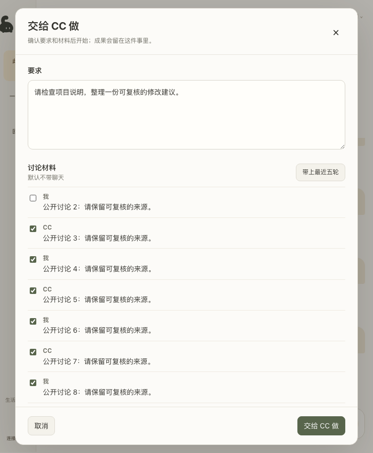
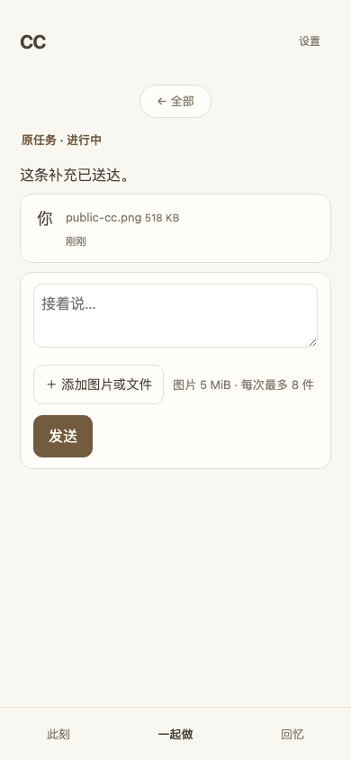

# 统一交办验证记录

代码实现与本地自动化验证完成，待整合者合并、部署和真机验收。分支 `codex/cc-task-entry`，独立工作区 `cc-user-experience/wechat-cc`。

2026-09-27 开工：原设计基线 `39cf7f5f`；实现前将仅含设计文档的分支同步到 `origin/dev@261a2ca10e428face03d2ad3d522fb2b627ee566`，实现起点 `d4397523`。其间上游仅变更 CI、发布和文档，产品源码及末条迁移 v67 均未变化。#119 已合入；#127 是对方后续拆分设计。

| 基线检查 | 结果 |
| --- | --- |
| Bun 1.3.14，全套，4 workers | 666 文件通过、1 跳过；8698 测试通过、10 跳过 |
| Node 26.4.0，全套，4 workers | 566 文件通过、2 跳过；7492 测试通过、11 跳过 |
| TypeScript | 通过 |
| 模块边界 | 通过；7 条既有循环依赖警告 |

使用冻结锁文件安装本工作区依赖，包清单和锁文件未改。Bun 全套先于同步运行；Node 全套在同步后运行，新增 CI 守卫另行用 Bun 验证。

本机可发现 Claude、Codex、Cursor 执行程序，但本记录不据此宣称账号已登录或执行能力可用。未读取凭据。服务层测试使用隔离主人、数据库、目录和受控执行者。

共享 daemon 的重启、部署、dev 合并和推送由 ggshr9 串行负责。实际 Tauri、真实手机、真实执行者的交办/图片/续接验收尚未进行，须分别记录结果，不能由单测代替。

已完成后端步骤 1–3：严格输入/持久登记（144 项定向测试）、独立工作目录与项目归属（38 项）、原子创建与兼容回归（独立复核后 8 文件、112 项）。新增迁移 v68；历史迁移指纹未变。独立复核发现的首次材料校验竞争与已登记目录出现未知文件，均已用失败用例复现并修复。真实双 SQLite 连接以受控交错检查单次接受；尚未以两个外部服务进程进行并发压力验收。

手机路由回归在首次 Cargo 满并发编译期间有两条既有 20 秒超时；保留超时设置，将本任务 Cargo 限为两并发后同文件 11 项全部通过。未归入已知 flake、未改超时。

Task 4: trusted desktop/phone entry routes plus current-owner desktop uploads; strict phone continuation foundation landed here. Bun 7 files / 178 tests passed, including revoked phone requests. Rust exact whitelist: 1 test passed / 5 filtered with CARGO_BUILD_JOBS=2 and process-only TAURI_CONFIG disabling externalBin resource packaging. Node initial routes run: 102 passed, one existing chunked-upload ECONNRESET during compile; isolated idle retry passed, complete Node suite remains final gate.

桌面步骤5：6文件190项定向测试通过；真实 Chromium 使用隔离服务、SQLite 与确定性执行者，12个宽/窄窗口场景无横向溢出，无页面或HTTP错误。报告及13张截图保存在 `/private/var/folders/yc/y9bc_lbd69z5_3_dqbt5bn6c0000gn/T/cc-companion-browser-evidence-BZoeQy/`。根代理检查了740px摘录预览截图。此记录证明浏览器组件与隔离HTTP接线，不等同于完整Tauri主窗口、真实模型或手机真人验收。

macOS「打开工作位置」仅向原生端传任务ID，由原生端读取daemon任务目录，检查绝对目录、路径链和本次inode再调用系统打开程序。7项新增Rust测试通过；连同工作台精确路由和body边界共11项通过，测试启动器为fixture未打开Finder。其他平台明确不支持；检查本次打开期间的目录身份，不声称核验创建以来的历史inode。

后端步骤7/8合并交付：10文件172项Bun集成验证通过。共享配额独立审查发现的预约编号跨owner/内容借用、旧桌面取消漏墓碑、handoff复制元数据漏计费，均先复现失败再修正；fresh review发现64条已绑定旧上传阻塞过期扫描，也已补失败用例并修为排除已绑定记录、游标有界推进。新增v69指纹 `2df729ce442f770e`，旧指纹未改。真实SQLite两连接交错与事务故障路径有覆盖，未宣称完成独立外部服务进程压力测试。

真实配对HTTP/加密relay handler使用公共资产 `moment-ai-offline.png`（529,448字节，大于512KiB）验证128KiB分块、重复中间/最后块、image-only创建和原回执重放；最终存储字节一致，双向密文帧均小于512KiB，撤销设备后三条材料接口及新交办接口拒绝。该12项自动化使用受控执行者，不是实际模型看图验收。

原生适配器隔离验收：`bun scripts/workbench-native-attachments-smoke.ts --run` 使用本机 Claude Code 2.1.282 与 Codex CLI 0.153.4、临时配置/目录、仅 loopback 的本地确定性模型服务。两家均通过首次图片字节、image-only补充、历史图片恢复与新图片续接、同一原生会话；Codex另验活动会话图片steer及过期请求拒绝，Claude另验PDF原生内容块。测试未访问云端模型、用户聊天或共享daemon，因此不能替代“真实模型理解图片”验收。

收尾全量首次发现两项回归：新手机材料样式硬编码圆角、legacy无owner任务的纯文字续聊被材料owner检查误拦。保留原测试修复两处，3文件83项回归通过；手机严格owner路径始终校验任务归属，新入口也不经过legacy兼容分支，独立复核确认无新增绕过。模块边界首次发现新增循环，已将EntryResult放在服务输出层，并把有界文件读取下移既有anchored-fs层；6文件128项、类型检查通过，循环警告由基线7条降为4条，未修改规则。

截图使用公开fixture，记录浏览器组件，不代表真机验收：

最终自动化验收（2026-09-27，产品代码提交 `b15ee2a1`）：

| 检查 | 结果 |
| --- | --- |
| `bun run test --maxWorkers=4` | 676文件通过、1跳过；9038测试通过、10跳过 |
| `npm run test:node -- --maxWorkers=4` | 575文件通过、2跳过；7792测试通过、11跳过 |
| `bun run typecheck` | 根目录及手机通过 |
| `bun run depcheck` | 0错误、4条既有循环警告；基线7条，无新增 |
| `bun run build:mobile` 后生成物差异检查 | 与已提交页面一致 |
| 手机 Chromium E2E | 17项通过；包括丢创建回包恢复、大图image-only创建/补充、公开对话与可展开工具记录 |
| 桌面 Playwright 全套 | 118项通过，独立临时状态与mock服务 |
| Rust工作台定向测试 | 11项通过（含7项打开工作位置），2项非本范围过滤 |
| `apps/desktop` 中 `bun run build-sidecar` | CLI与jobspawn构建通过，版本 `1.7.0 (b15ee2a1)` |
| `bun scripts/smoke-compiled-sidecar.ts` | 编译后二进制在空状态目录正确返回daemon_required，无SDK虚拟路径崩溃 |

Task6/9以同一个前端提交交付。新增工具记录默认折叠、全部转义、无记录不占位；公开对话直接可见，同任务刷新保留展开选择。验收末轮独立审查无剩余行动项，既有微信创建/续接、项目、恢复、成果相关回归包含在全套测试中。

构建限制：本工作区缺少既有绘图组件 `sd-cli-aarch64-apple-darwin`，构建脚本已明确提示无法在此完成完整macOS Tauri打包；本轮只验证CLI/jobspawn及Rust测试，不声称完整app打包成功。测试日志里既有marked sourcemap缺失、颜色变量冲突和一次mock服务空闲超时未造成失败；没有更改超时、忽略测试或增加flake白名单。

交接顺序：ggshr9审查本分支PR并合入dev，核验GitHub合并事件与实际merge SHA后，才把新基线交给等待⑥/⑦的Claude；当前基线仍为 `261a2ca1`。迁移已占用v68/v69。合并后由整合者串行构建/部署共享daemon，跑健康门及维护者workbench/chat selftest，再做真实Tauri、Safari/微信、云端模型看图和网络切换验收。该部分保留未完成，不由HTTP/CLI投递成功替代。后续agent协调层没有混入本批产品实现。

## #129 评审修复轮（2026-09-27）

收到 [10 条评审](https://github.com/tendhearth/wechat-cc/pull/129#issuecomment-5863067150) 后，分支已无冲突 rebase 到 `dev@4e46fbe54ec5f7d65ab6d3ed6c2e1ff8cea4a282`。上文 `261a2ca1` 与旧 CI 记录保留为历史证据，不代表本轮基线或最终结果。没有合并 dev、部署共享 daemon 或改动对方工作区。

本轮修复：手机允许当前主人对 owner=NULL 的旧任务纯文字续接，材料和其他主人任务仍拒绝；确定性内容/总摘要错误持久取消上传，手机刷新后也不再续传旧 ID；重复 accept 保留首个时间戳；受信 HOME 祖先链接解析到物理目录，预约先保存分配路径再创建；三端共用纯交办契约；预算类型改为显式 staged/resumable/tombstone。

接单材料由四次完整读取降为一次，读取与 SHA 在接受事务外执行，事务内复核材料元数据和从同一已读描述符取得的文件身份/时间戳。测试捕获 17 字节材料原先读取 68 字节，修复后为 17 字节；第二 SQLite 连接证明完整读取时未占写锁。独立审查抓到的到期判断顺序回归已补两条失败用例并修正：已到期预约优先返回 entry_expired，即使材料已过期或删除，也不会把手机卡在待确认。

8MiB 分块上传样本累计读取由 281,018,368 字节（268MiB）降至 25,034,752 字节（23.875MiB）。性能测试断言实际读取量和第二 SQLite 连接能否取得写锁，事务耗时仅记录观察值，不设置墙钟阈值。最终化与取消的交错、重启后的文件损坏、旧块篡改均有回归。复审另发现重复内容去重与同编号精确重放分支仍在写锁内读取 8MiB，现已移到事务外并在锁内复核同一描述符取得的文件身份。第二份相同 8MiB 文件累计读取 33,423,360 字节，精确重放读取 8,388,608 字节；两个分支均无锁内完整读取。并发新出现、尚未预验的 blob 返回可恢复错误，同编号重试会在锁外补验；74 项定向 Bun/Node 测试验证文件替换、竞争写入、取消与损坏元数据。

配额核对发生在新预约、最终化、复制和未知编号取消，不是每个分块。一次完整上传的 blob 清单从两次扫描降为一次，历史上传与交接行改为数据库聚合/定向查询；测试使用 1200 条终态记录及 1200 条交接记录验证不再全量载入 JS。跨连接预约、相同 SHA 的多个预约、外部原地增大的孤儿文件仍计费。仍保留准入事务内的 SQL 聚合与每目录最多 4096 项的真实磁盘扫描；没有引入跨请求缓存，也不宣称消除了全部锁内扫描。

rebase 后实际涉及的 bootstrap 文件为 `wire-workbench.ts`、`wire-workbench.test.ts`、`workbench-api.ts`。其接线与手机生成页定向回归 5 文件、120 项通过，保留 #131 的拆分。HOME junction 用例已写入跨平台测试，本地实际运行平台为 macOS，Windows 实际结果以本轮 CI 为准。

本轮最终代码自动化结果：

| 检查 | 结果 |
| --- | --- |
| Bun 全套，4 workers | 693 文件通过、1 跳过；9224 测试通过、10 跳过 |
| Node 全套，4 workers | 589 文件通过、2 跳过；7916 测试通过、11 跳过 |
| 根目录及手机 TypeScript | 通过 |
| 模块边界 | 0 错误、22 警告：4 条原有循环及新 dev 带来的18条临时 CLI→daemon 边界；未放宽规则 |
| 桌面 Playwright | 118 项通过，独立 mock 服务、单 worker，未连接共享 daemon |
| 手机 Chromium E2E | 17 项通过，显式使用 E2E 配置 |
| Rust 工作台 | 11 项通过、2 项本范围外过滤；两编译并发，仅进程配置取消 externalBin/resources 打包 |
| 手机生成物 | 重新生成，与源文件同步测试通过 |
| CLI/jobspawn 与编译后 smoke | 最终源码构建通过；隔离空状态目录正确返回 daemon_required，无虚拟路径崩溃 |

本轮未新增跳过项、提高超时或加入 flake 白名单。旧 HTTP create 的 unattended 428 保留，新 create-entry 与手机统一为 422。存储重复 accept 的时间戳缺陷已证实，但普通重试必然 409 的说法未证实；空间不足和临时 I/O/SQLite 故障保持可恢复，不作为永久内容错误处理。

GitHub 新提交的检查结果记录在 PR；旧 head `8072d185` 的绿色运行不能代替本轮 CI。完整 Tauri 打包仍受缺少既有 sd-cli 限制；真实设备、云端模型和共享部署仍由整合者验收。本轮不把测试通过或分支推送当作合并完成，后续基线仍应取实际 GitHub merge SHA。

Windows CI 跟进：`fd2f35e9` 的运行 [36383927299](https://github.com/tendhearth/wechat-cc/actions/runs/36383927299) 中，Linux、macOS、Node、desktop-e2e 通过，Windows 唯一失败为手机生成页同步。新共享源码未被原有 LF 属性清单覆盖，Windows autocrlf 改变了原样内联的换行。先把共享文件加入既有属性守卫，复现 eol:unspecified，再补精确路径的 text eol=lf。后续只修改检出属性和守卫：Bun/Node 各3文件、133项通过，手机生成物重建后无变化，运行代码及数据库未改。此问题按真实缺陷处理，没有重跑冒充修复或添加 flake 白名单；新提交的 Windows 结果仍需另行核验。
