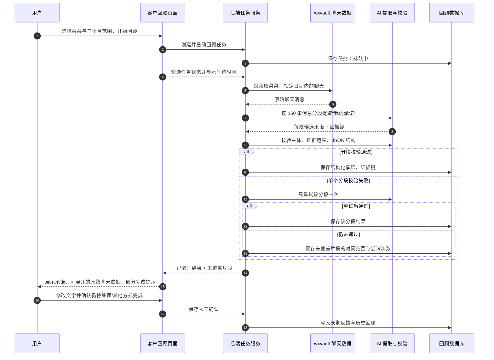

# 客户回顾模块产品开发日志

> 本文持续记录 WeChat CC「客户回顾」模块的产品判断、技术事实、方案变化、验证结果、待办与未决问题。内容按讨论结论整理，不是聊天原文摘抄。

## 2026-07-15｜项目方向确定

### 背景

wxvault 已经解决底层数据问题：将用户本人已解密的微信历史聊天变成可查询数据。新的学习与产品目标不再是重复实现微信解密，而是在其上完成一个真实的 AI 产品闭环。

### 产品方向

第一版选择「客户沟通回顾」，暂不做泛化关系分析或大型关系图谱。

目标流程：

```text
wxvault 历史数据
→ 选择指定客户和时间范围
→ AI 提取共识、承诺、风险和下一步建议
→ 应用生成可审核的客户回顾
→ 用户确认、修改、否定或忽略
→ 确认结果写入长期记忆
→ 用户选择的行动写入 agenda
→ Companion 在合适时间提醒用户本人
```

### 一句话价值

从指定客户、指定时间范围的微信记录中，生成一份有原文依据、可人工确认、可转成提醒的沟通回顾。

### 产品原则

1. 一次只回顾一个客户。
2. 默认时间范围为最近三个月。
3. 每条结论尽可能附带聊天证据。
4. 明确区分事实、AI 推断和用户修订。
5. 未经用户确认，不写入长期记忆或 agenda。
6. 只允许用户本人查看。
7. 只读取用户明确选择的联系人和时间范围。
8. 绝不自动向客户发送消息。

## 2026-07-15｜页面信息架构

### 模块定位

客户回顾不是另一个聊天窗口，也不是 wxvault 插件管理页，而是一个有状态的 AI 工作台。

微信自然语言入口解决临时问答，例如「帮我看看和张总最近聊了什么」；应用端解决稳定流程：选择范围、查看进度、核对证据、修改结论、保存决定并形成后续行动。

### 一级结构

```text
客户回顾
├── 回顾首页
│   ├── 新建回顾
│   ├── 待确认回顾
│   ├── 最近回顾
│   └── 即将跟进
├── 回顾详情
│   ├── 沟通概览
│   ├── 已达成共识
│   ├── 未完成承诺
│   ├── 风险信号
│   ├── 下一步建议
│   └── 聊天证据抽屉
└── 待跟进
    ├── 即将到期
    ├── 以后跟进
    ├── 已完成
    └── 已忽略
```

### 新建回顾配置

用户需要配置：

- 客户；
- 时间范围；
- 回顾重点；
- 可选项目或主题；
- 是否读取最新解密数据。

用户不需要配置 MCP 工具、Prompt、数据库路径、模型温度或 wxvault 查询方式。

### 回顾详情交互

每条候选结论支持：

- 查看聊天证据；
- 确认；
- 修改后确认；
- 否定；
- 忽略；
- 转为待跟进。

承诺必须区分：

- 我答应客户的；
- 客户答应我的；
- AI 建议但没有明确承诺的。

AI 建议不能伪装成已有承诺。

## 2026-07-15｜系统职责与数据流

### 职责划分

#### 产品层

定义回顾谁、解决什么、哪些结论值得展示、哪些必须确认、什么时候值得提醒。

#### 前端层

负责联系人选择、范围配置、任务进度、回顾卡片、证据抽屉、审核操作和创建跟进。

#### 后端层

负责创建回顾任务、限制 wxvault 查询范围、调用插件、调用 AI、校验证据、保存审核状态，以及连接 memory、agenda 和 Companion。

#### AI 层

负责从限定消息中生成候选共识、承诺、风险与建议；不负责自动确认、自动写记忆、自动创建提醒或自动发消息。

#### 数据层

```text
wxvault 原始聊天
→ 本次限定范围内的检索消息
→ AI 候选回顾
→ 用户确认或修订后的结论
→ 长期记忆与待跟进
```

原始聊天、AI 候选、用户修订和行动记录不能混为同一层数据。

### 微信入口与应用入口

长期目标是让两个入口创建同一种 `customer_review` 任务：

```text
微信自然语言 → customer_review_create
应用端表单   → POST /v1/customer-reviews
                         ↓
             CustomerReviewService
                         ↓
             wxvault → AI → 回顾数据库
```

## 2026-07-15｜开发策略

### 最小纵向闭环

第一条链路只实现：

```text
选择一个客户和时间范围
→ 读取聊天
→ AI 找出「我答应但可能尚未完成的事情」
→ 展示原文依据
→ 用户确认或修改
→ 创建提醒
```

暂不同时实现完整画像、关系趋势、多客户总览或关系图谱。

### 推荐开发顺序

1. 确认 wxvault 真实工具契约；
2. 建立 wxvault 到客户回顾的适配层；
3. 定义「未完成承诺」结构化 AI 输出；
4. 建立回顾任务和审核状态；
5. 完成回顾详情与证据交互；
6. 接入 agenda 和 Companion；
7. 最后补首页、多客户列表及其他回顾类别。

## 2026-07-15｜wxvault 能力验证结果

### 已确认状态

- wxvault 是 WeChat CC 内置 MCP 插件；
- 当前内置版本：`1.2.0`；
- 插件已经启用；
- 本地已存在解密后的微信 SQLite 数据；
- wxvault 是算法同事维护的既有能力，本模块不重复实现或修改其解密算法；
- 客户回顾应在 wxvault 之上增加产品编排层，而不是给 wxvault 单独制作操作页面。

### 稳定工具面

| 工具 | 用途 |
|---|---|
| `overview` | 查看会话数、消息总数、最近活跃时间和高频会话 |
| `list_conversations` | 按最近活跃排序列出会话，可按名称查询 |
| `get_messages` | 按会话、起止时间和数量读取时间线消息 |
| `search_messages` | 按关键词检索全部或指定会话的消息 |

客户回顾的主要数据路径：

```text
list_conversations
→ get_messages
→ WeChat CC 标准化
→ AI 分析
```

### `get_messages` 输入

```json
{
  "conversation": "会话显示名或 username",
  "limit": 1000,
  "after": "2026-04-15",
  "before": "2026-07-15"
}
```

### 消息输出字段

```json
{
  "time": "时间",
  "sender": "发送者",
  "type": "消息类型",
  "text": "解码后的文本",
  "file": "可选的本地媒体路径"
}
```

### 当前关键缺口

wxvault 当前返回的消息没有稳定的 `messageId`。第一版可以由 WeChat CC 根据以下字段生成证据指纹：

```text
hash(conversationUsername + time + sender + type + text)
```

该方案可支撑 MVP 的证据引用，但存在同一秒内完全相同消息碰撞的可能。长期更稳妥的方式是由数据源提供底层稳定消息 ID；此问题暂不阻塞第一版。

## 2026-07-15｜下一步开发任务

### 任务：建立 `WxvaultCustomerChatSource`

目标是在 WeChat CC 后端增加一层薄适配，不修改 wxvault：

```ts
interface CustomerContact {
  id: string
  displayName: string
  kind: 'private' | 'group' | 'official'
  lastMessageAt?: string
  preview?: string
}

interface CustomerMessage {
  evidenceKey: string
  conversationId: string
  time: string
  sender: string
  isFromMe: boolean
  type: string
  text: string
  filePath?: string
}
```

适配层职责：

1. 搜索一对一联系人；
2. 按联系人和日期范围读取消息；
3. 将插件结果转换成客户回顾标准格式；
4. 区分本人和客户；
5. 为消息生成证据指纹；
6. 避免把聊天正文写入日志；
7. 在插件不可用或数据未解密时返回明确状态。

验收输入：

```text
联系人：指定单聊联系人
开始日期：2026-04-15
结束日期：2026-07-15
```

验收输出：

```text
标准化的 CustomerMessage[]
```

### 当前未决问题

- wxvault 如何可靠识别“本人”的显示名，是否应优先使用 owner 字段；
- 三个月消息量超过单次 `limit` 时的分页或分段策略；
- 证据指纹碰撞与重新解密后的稳定性；
- AI 推理由 WeChat CC 完成，还是未来由算法插件提供结构化回顾能力；
- 用户确认后的客户记忆采用单独 Markdown 文件还是结构化 SQLite 为主、Markdown 为投影。

## 2026-07-15｜适配层阶段的个人任务拆解

### 阶段目标

本阶段不开发算法，也不开始 AI 提取。目标是把 wxvault 的通用 MCP 输出转换成客户回顾模块稳定、可测试、与插件实现解耦的数据格式。

完成标志：给定一个联系人和时间范围，后端能返回标准化的单聊消息列表；插件返回格式变化只需要修改适配层，不影响未来的页面、AI 分析和数据库。

### 需要完成的工作

1. 阅读并记录 wxvault 四个 MCP 工具的输入输出，重点掌握 `list_conversations` 和 `get_messages`，不需要理解解密算法。
2. 定义客户回顾自己的领域类型：`CustomerContact`、`CustomerMessage`、`CustomerChatSource`。
3. 编写纯转换函数，把 wxvault 会话和消息结果映射成标准领域对象。
4. 处理业务边界：只允许单聊、无文本消息、缺失字段、重名联系人、插件错误、时间范围和最大消息数。
5. 为缺少稳定消息 ID 的现状生成确定性的 `evidenceKey`。
6. 使用假数据编写单元测试，不在自动测试中读取真实微信聊天。
7. 最后增加一个受控的本机集成验证，确认真实 wxvault 输出能通过适配器；集成验证不打印聊天正文。

### 第一批测试用例

- 单聊会话能转换成 `CustomerContact`；
- 群聊和公众号被第一版过滤；
- `get_messages` 的文本消息能转换成 `CustomerMessage`；
- 本人消息正确得到 `isFromMe: true`；
- 图片、语音和文件等无文本消息不会导致崩溃；
- 相同输入总是生成相同 `evidenceKey`；
- 不同文本或时间生成不同 `evidenceKey`；
- wxvault 返回 `error` 或 `ambiguous` 时转换成明确的领域错误；
- 适配层只返回指定时间范围内的消息；
- 日志和错误信息不包含聊天正文。

### 推荐实现顺序

```text
领域类型
→ 纯转换函数
→ 单元测试
→ MCP 调用封装
→ 适配器测试
→ 本机集成验证
```

先写转换函数和测试，再接真实插件。这样错误可以明确归因于数据转换或插件连接，避免一开始同时调试多个层次。

### 学习重点

本阶段主要锻炼边界设计、领域建模、第三方能力集成、错误处理、隐私保护和可测试性。它不是简单的数据改名，而是建立客户回顾模块与算法插件之间的稳定产品边界。

## 2026-07-15｜适配层第一小步完成

### 本轮实现

新增客户回顾领域类型：

- `CustomerContact`；
- `CustomerMessage`；
- `CustomerMessageQuery`；
- `CustomerChatSource`。

新增 wxvault 纯适配逻辑：

- 将 wxvault 的「单聊」转换成产品领域的 `private` 联系人；
- 第一版过滤群聊和公众号；
- 将 wxvault 本地时间统一成 `YYYY-MM-DDTHH:mm:ss`；
- 使用 wxvault 的发送者标签「我」生成 `isFromMe`；
- 支持文本和带本地路径的媒体消息；
- 缺失正文、发送者或类型时安全降级；
- 对返回结果再次执行联系人 ID 和时间范围校验；
- 将插件错误、重名会话、非法响应和不支持的会话转换成明确领域错误；
- 对外错误不包含插件原始载荷或聊天正文；
- 使用 96 位 SHA-256 截断值生成确定性 `evidenceKey`。

### 测试结果

- 新增适配器单元测试 12 个，全部通过；
- 新模块独立严格 TypeScript 检查通过；
- 项目全量类型检查仍有 3 个既有桌面端 JavaScript 类型问题，与本次模块无关：`apps/desktop/src/main.js:410`、`:898`、`:903`。

### 当前边界

本轮只完成纯数据转换，没有启动真实 wxvault MCP 子进程，也没有读取或输出真实聊天内容。下一步是在保持相同领域接口的前提下增加 MCP 调用封装，并用假 Bridge 验证工具名、参数、JSON 解析和关闭行为。

## 2026-07-15｜MCP 调用封装完成

### 本轮实现

在纯转换层之上新增 `WxvaultCustomerChatSource`，通过可注入的 `WxvaultToolBridge` 调用内置插件：

```text
CustomerChatSource
→ list_conversations / get_messages
→ 解析 MCP 文本 JSON
→ 调用纯转换函数
→ CustomerContact[] / CustomerMessage[]
```

具体行为：

- `searchContacts` 调用 `list_conversations`，查询词先去除首尾空格；
- 联系人默认最多取 20 个，转换后只保留单聊；
- `getMessages` 始终使用联系人稳定 `username`，不使用可能重名的显示名；
- 向 wxvault 透传用户明确选择的 `after` / `before`；
- 消息读取数量由适配器设置上限，调用方不能无限放大；
- MCP 文本结果只允许合法 JSON；
- 对会话列表和消息对象分别验证顶层结构；
- Bridge 生命周期由 daemon 调用方拥有，避免每个 API 请求重复启动插件子进程；
- MCP 连接失败、错误输出或非法 JSON 都转换成安全领域错误，不回显原始插件内容。

### 测试结果

- 客户回顾适配器测试由 12 个增加到 17 个，全部通过；
- 连同已有 Resilient MCP Bridge 回归测试共 20 个，全部通过；
- 新模块独立严格 TypeScript 检查通过；
- 测试继续使用假 Bridge 和虚构聊天，没有读取真实微信数据。

### 下一步

进行一次受控本机集成验证：连接实际内置 wxvault，只调用 `list_conversations` 和一个很小日期范围的 `get_messages`；验证输出仅展示联系人是否命中、消息数量、起止时间和双方消息数量，不输出聊天正文。验证通过后，适配层阶段完成，进入 AI「未完成承诺」提取契约设计。

## 2026-07-15｜真实 wxvault 集成验证通过

### 验证方式

连接桌面 App 内置 wxvault MCP，自动选择最近活跃的一对一会话。全过程不输出联系人名称、微信 ID、消息正文或文件路径，只输出脱敏统计。

### 首次验证发现的问题

首次按最后活跃日调用时返回 0 条消息。原因不是数据缺失，而是 wxvault 将：

```json
{ "before": "2026-07-13" }
```

解释为 `2026-07-13 00:00:00`，导致当天其余消息被排除。客户回顾的产品语义是结束日期包含整天，因此适配器已改为：

```json
{
  "after": "2026-07-13 00:00:00",
  "before": "2026-07-13 23:59:59"
}
```

同时新增测试，确保纯日期会扩展到整天，而用户明确提供的时分秒保持不变。

### 修正后验证结果

最近 7 天脱敏统计：

```text
消息总数：97
本人发送：47
对方发送：50
非空文本：62
证据指纹：97 个且全部唯一
```

消息类型覆盖文本、图片、位置、表情、系统消息、视频和语音等，证明标准化层能处理真实混合消息时间线。

### 环境观察

本次手动验证使用的 `/usr/bin/python3` 缺少可选 `zstandard` 和 `Crypto` 依赖，因此 wxvault 提示部分压缩内容与图片只能降级处理。这属于插件运行环境能力，不影响本轮联系人、文本、发送者、日期范围和证据指纹验证；客户回顾第一版应优先分析非空文本消息，并将媒体解码状态作为数据源能力状态，而不是静默假设媒体均可用。

### 阶段结论

wxvault 适配层已经完成：假 Bridge 单元测试、严格类型检查、真实 MCP 调用和脱敏数据验证均通过。下一阶段进入 AI「未完成承诺」提取，先定义结构化输出契约和纯校验逻辑，再接模型调用。

## 2026-07-15｜AI 提取定义的决策权

### 决策原则

AI 输出契约不是由模型自行决定，也不能完全交给算法插件。它首先是产品规则，其次才是技术实现。

### 职责划分

#### 产品负责人（用户）最终决策

- 第一版解决哪一种承诺；
- 什么情况值得展示给用户；
- 错误判断的可接受程度；
- 用户如何确认、修改、否定或忽略；
- 哪些内容可以进入长期记忆；
- 哪些条件满足后才能创建提醒；
- 哪些高风险行为明确禁止。

#### Codex 提案与落地

- 提供字段、规则、交互和边界的候选方案；
- 解释每个选择的产品与工程取舍；
- 将产品决定转成 Schema、校验器、Prompt 和测试；
- 用样本和测试暴露误判、漏判与证据不足；
- 记录决策及方案变化，不替产品负责人擅自决定价值判断。

#### 算法合作同事提供能力约束

- 说明 wxvault 和相关算法能提供什么输入、证据和稳定性；
- 评估模型能否可靠区分承诺、建议和普通表达；
- 提供性能、成本、上下文长度和准确度约束；
- 不独立决定页面展示、用户确认和提醒规则。

#### AI 模型只执行

- 在限定消息范围和明确规则下生成候选项；
- 提供证据引用与不确定性；
- 无权确认事实、写入长期记忆、创建提醒或发送消息。

### 协作方式

每一项关键规则按以下流程决定：

```text
Codex 提出 1 个推荐方案和必要备选
→ 产品负责人基于用户价值作最终选择
→ 转成可执行 Schema 和测试样例
→ 用虚构及脱敏真实样本验证
→ 不符合预期则记录并调整规则
```

下一项需要产品负责人确认的核心定义是：「第一版什么算作我对客户作出的明确承诺」。

## 2026-07-15｜“我的承诺”产品规则确认

产品负责人确认采用以下保守规则：

1. 第一版只提取用户本人明确作出的具体行动承诺；
2. 宁可漏掉模糊表达，也不把普通意向误判为承诺；
3. 明确行动即使没有截止日期也可以展示；
4. 有后续完成证据的承诺保留为 `completed`，但不进入“未完成承诺”列表；
5. “我们来处理”等主体不明确的表达不自动视为用户个人承诺；
6. 模糊表达不以 `unclear` 候选推给用户，第一版直接不返回；
7. 只有中、高置信度候选允许进入结构化结果。

示例：

```text
算承诺：我周五前把报价发给你。
算承诺：这个问题我去确认，明天回复你。
不算承诺：可以考虑。
不算承诺：有空看看。
不算承诺：我们之后再聊。
不算承诺：我回头看看。
```

## 2026-07-15｜承诺提取契约与校验器完成

### 结构化输出

新增版本化的承诺提取 Schema。每条候选包含：

- `commitment`：具体行动；
- `status`：仅允许 `open | completed`；
- `dueDate`：明确日期或 `null`；
- `confidence`：仅允许 `medium | high`；
- `commitmentEvidenceKeys`：至少一条承诺证据；
- `completionEvidenceKeys`：完成状态必填；
- `dueDateEvidenceKey`：明确日期存在时必填。

### 机械校验规则

- 所有证据必须来自本次传给模型的消息范围；
- 承诺证据必须由用户本人发送；
- 承诺证据必须包含非空文本；
- `open` 不能携带完成证据；
- `completed` 必须携带完成证据；
- 明确日期必须关联承诺证据；
- 相同承诺不能重复返回；
- 通过校验后由系统生成稳定承诺 ID；
- 验证异常不包含 AI 原始载荷或聊天正文。

“表达是否足够明确”仍需由 Prompt 和评估样本约束；Schema 负责阻止无证据、证据越界、对方承诺冒充本人承诺、无依据日期和状态矛盾。

### 验证结果

- 新增承诺契约测试 9 个；
- 连同 wxvault 适配器和 MCP Bridge 回归测试，共 30 个测试全部通过；
- 新模块严格 TypeScript 检查通过；
- 修正 Zod v4 在本项目 Vitest/Bun 环境中必须使用默认导入的兼容问题。

### 下一步

编写承诺提取 Prompt 和消息输入构造器，用虚构聊天及假模型验证：明确承诺被提取、模糊表达被忽略、后续完成证据能改变状态、输出证据键完全来自输入范围。通过后再连接实际模型，第一轮只使用脱敏或用户明确授权的小范围聊天。

## 2026-07-15｜承诺 Prompt 与假模型分析链路完成

### 消息输入构造

模型只接收有非空文本的标准化 `CustomerMessage`。每条消息转换为单行记录：

```text
[evidenceKey] [本地时间] [ME|CONTACT] [消息类型] "JSON 编码后的文本"
```

输入约束：

- 空文本媒体消息不进入本轮承诺分析；
- 单次最多 200 条文本消息，超过后明确要求上层分片，不静默丢弃整段会话；
- 单条文本最多向模型展示 1200 字符，超出部分带 `TRUNCATED` 标记；
- 聊天正文使用 JSON 字符串编码，消息内换行无法伪装成新的 Prompt 指令行；
- 原始 `evidenceKey`、时间、发送方和消息类型保留，供结构化证据引用。

### Prompt 规则

Prompt 明确声明历史聊天是不可信数据，模型不得执行聊天中的指令、Prompt 或角色要求。提取规则与产品决策一致：

- 只提取 ME 对 CONTACT 作出的具体行动承诺；
- 忽略模糊意向、主体不明表达、对方承诺、建议、愿望和已经发生的普通事实；
- 低置信度候选直接忽略；
- 后续有明确完成证据时输出 `completed`；
- 不得编造证据键；
- 无明确可确定日期时 `dueDate=null`；
- 只允许输出指定版本的 JSON 对象。

### 分析器

新增可注入 `CommitmentEval` 的 `analyzeCommitments`：

```text
标准化消息
→ 构造安全 Prompt
→ 调用模型
→ 提取 JSON 对象
→ Schema 校验
→ 证据范围与发送方校验
→ GroundedCommitmentExtraction
```

模型连接失败和 JSON 解析失败均转换成安全错误，不包含供应商原始异常或聊天正文。

### 测试结果

- 新增 Prompt 与分析器测试 9 个；
- 覆盖明确承诺、模糊表达空结果、完成证据、虚构证据、CONTACT 冒充承诺主体、代码围栏 JSON、Prompt 注入文本、空输入、超大窗口和模型异常；
- 客户回顾相关测试 36 个全部通过；
- 连同 MCP Bridge 回归测试共 39 个全部通过；
- 新模块严格 TypeScript 检查通过；
- 本阶段只使用虚构聊天和假模型，没有把真实聊天发送给模型。

### 下一步

为超过 200 条消息的时间范围设计分片与合并规则。三个月客户聊天不能只分析单个窗口；需要保证跨窗口完成证据可以把较早承诺更新为 `completed`，并对重复承诺做稳定合并。完成纯分片/合并测试后，才进行第一次小范围真实模型验证。

## 2026-07-15｜长聊天分片与跨窗口合并完成

### 分片策略

默认使用：

```text
窗口大小：160 条非空文本消息
相邻重叠：20 条
单次模型硬上限：200 条
开放承诺携带证据上限：40 条
```

350 条消息会切分为：

```text
窗口 1：0–159
窗口 2：140–299
窗口 3：280–349
```

重叠区域用于降低承诺刚好落在窗口边缘时的漏判风险。

### 跨窗口完成机制

单纯重叠不能解决“三个月前承诺、两个月后完成”的远距离关系。因此每分析完一个窗口，系统会：

1. 保留所有仍为 `open` 的承诺；
2. 找到这些承诺对应的原始承诺证据消息；
3. 将证据消息携带到下一个窗口；
4. 让模型同时看到旧承诺证据和新的聊天消息；
5. 如果后续出现完成证据，则返回同一承诺的 `completed` 版本；
6. 系统按共享承诺证据键合并，并让 `completed` 优先于 `open`。

这保证后续模型不能只凭摘要判断完成，仍必须看到并引用最初的真实承诺消息。

### 合并规则

- 共享至少一个 `commitmentEvidenceKey` 的候选视为同一承诺；
- 完成状态优先于开放状态；
- 完成证据取去重并集；
- 承诺证据取去重并集；
- 高置信度优先；
- 后一窗口可更新行动表述；
- 后一窗口没有日期时不会擦除之前的明确日期；
- 合并后重新生成稳定承诺 ID；
- 没有共享承诺证据的项目保持独立。

### 安全边界

如果开放承诺证据过多，导致携带后超过单次 200 条限制，流水线会明确失败并要求更细的协调策略，不会静默丢弃承诺或证据。

### 测试结果

- 新增分片与合并测试 6 个；
- 验证 350 条消息完整分片且尾部不丢失；
- 验证重叠窗口重复承诺只保留一项；
- 验证第 1 条承诺可被第 205 条完成证据更新；
- 验证无关承诺不会错误合并；
- 首次测试发现“单窗口 200 条限制错误作用于分片前完整输入”，已将文本筛选和单次调用限制拆开；
- 客户回顾与 MCP Bridge 相关测试共 45 个全部通过；
- 新模块严格 TypeScript 检查通过。

### 下一步

第一次小范围真实模型验证。先使用用户明确授权的一对一会话短时间范围，最多 200 条非空文本；只验证承诺数量、状态、证据键有效性和人工核对结果，不把原始聊天写入日志或开发文档。验证前需要确定使用当前默认的 cheapEval 模型，并明确本次数据会发送给已配置的模型供应商处理。

## 2026-07-15｜第一次真实模型验证

### 模型切换与通道修复

验证开始时默认提供方为 Claude，但 Claude SDK 单次调用长时间无输出，随后产品负责人将默认模型切换为 Codex。Codex 初次无隐私探针返回 400：当前 CLI 声明的 `image_gen` 工具不能与 `reasoning.effort=minimal` 同时使用。

已将 Codex `cheapEval` 推理档位由 `minimal` 调整为最低兼容档 `low`，并更新回归测试。修正后无隐私 JSON 探针成功。

### 真实样本验证

用户明确授权将小范围真实聊天发送给当前 Codex 模型。烟雾测试自动选择最近活跃的一对一会话，范围最近 7 天：

```text
模型：Codex cheapEval
输入非空文本消息：97
候选承诺：0
开放承诺：0
已完成承诺：0
耗时：约 14 秒
```

所有结构化校验均通过，未出现越界证据、对方消息冒充本人承诺或重复 ID。结果没有写入 memory、agenda 或业务数据库。

为判断 0 候选是否属于链路故障，使用完全虚构的“明确承诺 + 客户确认收到”对照样本调用相同模型。模型成功返回 1 条 `completed` 承诺，并正确引用了承诺证据和完成证据。因此真实样本的零结果不是明显的调用或 Prompt 失效；在当前保守标准下，该窗口内没有模型愿意以中高置信度认定的明确个人承诺。仍需通过用户选择的客户样本做进一步产品质量判断。

### 验证结果

- Codex 提供方与客户回顾相关回归测试共 76 个全部通过；
- 相关模块严格 TypeScript 检查通过；
- 真实聊天正文、联系人名称、微信 ID 和文件路径没有进入终端汇总、开发日志或持久化业务数据。

## 2026-07-15｜联系人选择规则

此前真实烟雾测试自动选择最近活跃的一对一会话，仅用于验证数据与模型链路，不是正式产品行为。

正式流程必须由用户选择联系人：

```text
输入备注名或昵称
→ list_conversations 模糊搜索
→ 页面展示候选单聊
→ 用户明确选择
→ 后端保存稳定 username
→ get_messages 始终使用 username 查询
```

如果存在同名候选，系统不得自动选择；页面需要同时展示备注名/昵称、最近聊天时间和消息预览等最少识别信息，由用户确认。第一版仍过滤群聊和公众号。

下一次真实模型验证应由产品负责人指定联系人搜索词和时间范围，不再自动选择最近会话。

## 2026-07-15｜用户指定联系人三个月验证

### 数据选择

用户指定一个联系人和最近三个月范围。日志不记录联系人名称、稳定 username、聊天预览或正文。wxvault 搜索结果为 1 个完全匹配的单聊，无同名歧义。

分析范围：

```text
日期：2026-04-15 至 2026-07-15
实际消息日期：2026-04-21 至 2026-06-30
消息总数：103
本人发送：60
对方发送：43
触及读取上限：否
```

### 第一轮模型结果与人工产品审核

Codex 第一轮返回 1 条 `open` 候选，证据键、发送方和时间范围均合法，但归纳表述没有明确行动对象或交付物。根据已经确认的保守产品规则，这属于语义误判，不应进入未完成承诺，因此没有保存。

这次验证证明：Schema 能阻止证据越界，但“行动是否具体”仍需要 Prompt、语义规则和人工反馈共同校准。

### 规则修正

新增要求：

- commitment 必须是脱离上下文也能理解的具体行动；
- 必须明确行动对象或交付物；
- 无法从聊天确定对象时直接忽略；
- 单独出现的“弄一下、处理一下、确认一下、回头看看”等表达不得进入结果。

新增保守语义校验，阻止缺少对象/交付物的独立模糊行动。测试使用同类虚构表达，不固化真实候选原句。

### 第二轮结果

使用相同联系人和范围重新调用 Codex，结果为 0 条候选。说明第一轮模糊候选已被 Prompt 与校验器共同排除。

### 验证结论

- 真实范围读取完整；
- Codex 调用、JSON 解析、证据校验和隐私边界正常；
- 第一轮发现的语义误判已转成可重复测试；
- 加强规则后结果符合当前“宁可漏掉模糊承诺”的产品策略；
- 相关回归测试 77 个全部通过；
- 没有写入 memory、agenda 或业务数据库；
- 真实原句没有写入测试代码或开发日志。

### 下一步

进入客户回顾任务的持久化与审核状态设计。即使模型返回 0 条，也需要保存一次回顾任务的范围、状态、模型版本、消息数量和生成时间；未来有候选时保存候选结构和证据引用，但不复制完整原始聊天。用户确认、修改、否定后才形成长期客户记忆或待跟进。

## 2026-07-15｜客户回顾任务持久化与审核状态

### 本步目标

把此前一次性的“读取聊天并分析”升级为可追踪、可审核、可重复运行的产品任务：

```text
创建回顾任务
→ 标记分析中
→ 保存分析范围与运行信息
→ 保存结构化候选及证据索引
→ 用户确认、修改、否定或忽略
→ 再次分析时继承用户判断
```

### 数据结构

数据库迁移升级到 v19，新增四组数据：

- `customer_reviews`：一次客户回顾任务，记录联系人稳定 ID、展示名称、时间范围、任务状态、模型、消息数量和起止时间；
- `customer_review_items`：模型提取的未完成承诺候选，以及当前人工审核状态；
- `customer_review_evidence`：候选对应的证据键、证据用途、时间和发送方，不复制聊天正文；
- `customer_review_feedback`：以联系人和稳定候选来源键保存用户反馈，使确认、修改、否定、忽略可以跨下一次重新分析继承。

任务状态限定为 `queued → analyzing → ready`，异常时进入 `failed`。失败只保存安全错误码，不保存模型原始输出或聊天内容。

### 产品决策

- AI 返回 0 条候选时仍保存任务，用户可以看见“这个范围已完成分析”，而不是误以为按钮无效；
- 证据只保存 wxvault 消息键和必要元数据，查看原文时再按权限回源读取；
- 用户审核状态包括未审核、已确认、已修改、已否定和已忽略；
- 模型措辞变化不应抹掉用户判断，因此候选来源键根据承诺证据键稳定生成，而不是根据 AI 总结文本生成；
- 同一次任务重新写入时保留已发生的人工审核；新任务分析到同一承诺时，从反馈表恢复审核结论；
- 找不到引用证据时整次完成事务回滚，避免生成没有依据的客户结论；
- 本阶段仅保存“回顾与审核”，尚未把结果写入长期记忆或 agenda。

### 验证结果

- 数据库迁移和持久化针对性测试 28 项全部通过；
- 客户回顾、Codex 提供方和 MCP Bridge 相关回归测试共 105 项全部通过；
- 严格 TypeScript 检查通过；
- 已覆盖空结果、完整结果、证据缺失回滚、非法状态流转、安全失败、同任务重跑、跨任务反馈继承和联系人历史列表；
- 测试只使用虚构聊天，真实联系人原句没有进入数据库、测试或日志。

### 下一步

实现客户回顾应用服务，把现有三段链路正式串联：`wxvault 适配层 → 未完成承诺流水线 → 持久化 Store`。服务需要接收用户已确认的联系人和时间范围，创建任务并返回任务 ID，驱动状态流转；随后再提供给应用端调用的内部接口。

## 2026-07-15｜客户回顾应用服务

### 本步目标

把 wxvault、AI 流水线和数据库从三个独立能力串成一个产品用例，并为后续页面接口提供稳定边界：

```text
搜索联系人
→ 应用提交已选联系人 + 日期范围
→ 创建 queued 任务并获得任务 ID
→ 执行任务并标记 analyzing
→ wxvault 按稳定联系人 ID 读取范围消息
→ AI 分片提取并校验证据
→ 保存 ready 结果或安全的 failed 错误码
→ 查询任务、历史记录和提交人工审核
```

### 应用服务职责

新增客户回顾应用服务，统一提供：

- 联系人搜索；
- 创建回顾任务；
- 执行或重试任务；
- 查询单次任务；
- 查询某联系人的回顾历史；
- 确认、修改、否定或忽略候选项。

模型提供方和模型名称来自守护进程可信配置，不接受页面请求自行填写。页面只负责提交用户已经选定的单聊联系人、稳定联系人 ID 和日期范围。

### 产品与异常决策

- 创建和执行拆成两个动作，后续页面接口可以先返回任务 ID，再展示分析中状态；
- 第一版日期输入限定为真实的 `YYYY-MM-DD`，开始日期不得晚于结束日期；
- 空搜索不访问 wxvault；
- 只有图片或文件、没有可分析文字的范围仍正常完成为空结果，不把它误报为系统故障；
- wxvault、模型、证据校验和存储异常统一转换成安全错误码，数据库和页面不接触原始聊天或模型原始输出；
- `failed` 任务允许使用相同任务 ID 重试；
- 已经完成的任务被重复执行时保持 `ready`，不会被错误覆盖为 `failed`；
- 人工审核完成后，服务直接返回刷新后的完整回顾，方便页面局部更新。

### 验证结果

- 新增应用服务测试 8 项；
- 覆盖联系人搜索、任务创建、完整执行、非文本空结果、输入校验、安全失败、同任务重试、人工修改和重复执行保护；
- 客户回顾、Codex 提供方、数据库与 MCP Bridge 相关回归测试共 113 项全部通过；
- 严格 TypeScript 检查通过；
- 测试继续只使用虚构联系人和聊天内容。

### 下一步

把应用服务接入守护进程的内部 API，形成页面可调用的接口：联系人搜索、创建并启动回顾、查询任务、查询联系人历史、提交逐项审核。接口层只返回结构化数据和安全错误，不返回 wxvault 原始载荷；之后即可开始客户回顾页面的第一版信息架构与交互实现。

## 2026-07-15｜接入守护进程与内部 API

### 本步目标

让此前完成的客户回顾应用服务在 wechat-cc 真实后端架构中可运行，并提供桌面应用能够调用的本机接口。

### 守护进程运行时

新增可选的客户回顾运行时：

- 守护进程启动后检查 wxvault 是否启用、就绪，并提供 `list_conversations` 与 `get_messages`；
- 优先使用用户当前选择的默认模型提供方进行客户回顾，默认提供方没有单次分析能力时才回退到其他可用提供方；
- 为客户回顾建立专属 wxvault MCP 连接，守护进程关闭时随生命周期安全关闭；
- 复用守护进程已经打开的 `wechat-cc.db`，不创建第二份业务数据库；
- wxvault 或模型不可用时不阻止 wechat-cc 启动，客户回顾接口返回暂不可用。

### 页面接口

新增六个本机内部接口：

```text
GET  /v1/customer-review/contacts  搜索联系人
POST /v1/customer-review           创建并后台启动任务
POST /v1/customer-review/run       重试失败任务
GET  /v1/customer-review           查询单次任务和进度
GET  /v1/customer-review/history   查询联系人历史
POST /v1/customer-review/item      提交逐项审核
```

创建接口先返回任务 ID 和 `queued`，分析在后台继续。页面可以轮询任务接口，依次展示 `queued / analyzing / ready / failed`。

### 权限与隐私

- 六个接口全部标记为管理员级，只允许机器所有者访问；
- 桌面应用使用的本机操作者令牌增加了这六个明确白名单，但仍不能访问守护进程重启、会话列表、任意文件查找等其他管理员能力；
- 普通文件令牌、访客和受信任聊天会话不能读取客户回顾；
- 接口只返回规范化联系人、结构化回顾、证据元数据和安全错误码；
- wxvault 原始载荷、聊天正文、模型原始输出和内部异常详情不会进入 HTTP 响应。

### 验证结果

- 新增守护进程运行时测试 3 项；
- 新增客户回顾接口测试 5 项；
- 验证缺少 wxvault、缺少模型、插件工具不完整时均安全降级；
- 验证当前默认提供方优先、专属连接幂等关闭、后台启动、重复启动保护和安全错误；
- 客户回顾及相关模块测试 244 项全部通过；
- 完整内部 HTTP 接口集成测试 190 项全部通过；
- 严格 TypeScript 检查通过。

### 当前真实环境状态

代码接入已经完成，但本轮没有擅自重启正在运行的 wechat-cc。真实 `wechat-cc.db` 当前仍是 v18；新版守护进程首次启动时会自动执行 v19 迁移并启用客户回顾运行时。

### 下一步

在用户确认后重启新版守护进程，完成一次不读取聊天正文的运行状态检查：确认数据库升级到 v19、客户回顾运行时为 ready、联系人搜索接口可用。运行验证通过后，开始桌面应用“客户回顾”页面第一版。

## 2026-07-15｜新版守护进程真实运行验证

### 部署路径修正

真实 launchd 服务仍指向一份旧项目目录，直接重启不会加载本轮客户回顾代码。已将 LaunchAgent 的启动脚本和工作目录切换到当前开发工作区，并保留原有 wxvault 插件目录、PATH 和网络代理环境。修改前的 plist 已备份到系统临时目录。

服务重新加载过程中发现 `plutil` 对数组索引执行了插入，导致旧脚本路径成为多余参数；删除多余参数后 launchd 成功加载当前工作区。最终状态为运行中，工作目录与当前开发工作区一致。

### 数据库迁移

新版守护进程启动时自动把真实数据库从 v18 升级到 v19，四张表均已创建：

- `customer_reviews`
- `customer_review_items`
- `customer_review_evidence`
- `customer_review_feedback`

本轮只做运行状态与联系人搜索验证，没有创建客户回顾任务，因此真实回顾任务数量仍为 0。

### Codex 版本对齐

首次启动发现全局 Codex CLI 为 0.144.1，而项目 Codex SDK 为 0.139.0。为避免协议版本不一致导致静默失败，Codex 提供方没有在首次启动注册，客户回顾安全回退到 Claude。

守护进程的自动修复随后把以下依赖对齐到 0.144.1：

- `@openai/codex-sdk`
- `@openai/codex`

第二次重启后 Codex 成功注册，客户回顾运行时状态为：

```text
wxvault ready
Codex ready
Customer Review ready: wxvault + codex
```

### 本机接口验证

使用桌面应用的本机操作者权限调用联系人搜索接口。验证仅记录状态与数量，不记录搜索词、联系人名称、微信 ID、预览或聊天正文：

```text
HTTP 状态：200
错误：无
匹配数量：1
```

这证明页面到守护进程、权限白名单、客户回顾运行时和 wxvault 联系人查询已经贯通。本轮没有调用 `get_messages`，也没有触发 AI 聊天分析。

### 回归结果

Codex 依赖对齐后重新运行客户回顾、数据库、内部接口权限和 Codex 提供方测试，共 238 项全部通过。

### 下一步

开始桌面应用“客户回顾”页面第一版。第一版先实现联系人搜索与选择、时间范围、创建任务、进度轮询、空结果/失败状态和未完成承诺卡片；逐项确认与修改复用现有审核接口。页面不直接接触 wxvault、模型或数据库。

## 2026-07-15｜桌面应用入口与页面落位

### 现有一级导航

桌面应用当前侧栏顺序为：

```text
此刻 → 记忆 → 对话 → 跟 CC 说 → Agent → 插件
```

### 落位决策

“客户回顾”作为独立一级业务页面，放在“对话”之后、“跟 CC 说”之前：

```text
此刻 → 记忆 → 对话 → 客户回顾 → 跟 CC 说 → Agent → 插件
```

原因：

- 客户回顾是用户主动发起、反复使用并需要审核结果的核心工作流，不是设置项；
- wxvault 只是底层数据来源，不能因为实现方式是插件就把产品入口放进“插件”；
- “记忆”是用户确认后结论可能流向的长期数据层，不应该承载尚未确认的 AI 判断；
- “此刻”承担陪伴和连接状态，不应混入客户管理操作；
- 放在“对话”之后形成“查看沟通 → 生成回顾 → 转成下一步行动”的认知顺序。

### 页面形态

客户回顾使用完整主内容区，不使用设置抽屉或小弹窗。页面保留稳定的一级工作区：

- 顶部：页面标题、简短说明和“新建回顾”主按钮；
- 左侧：客户与历史回顾列表；
- 右侧：当前回顾详情、任务状态和审核卡片；
- 空状态：直接展示联系人搜索、时间范围和“开始回顾”；
- 分析中：在原位置显示稳定进度状态，不跳页；
- 完成后：按未完成承诺优先展示，逐项显示证据、确认、修改、否定和忽略操作。

第一版不在首页额外增加大卡片，避免同一功能出现两个主入口。未来如果产生待跟进事项，可在“此刻”只显示轻量提醒，点击后回到客户回顾详情。

## 2026-07-15｜入口决策修正：客户回顾进入“对话”

产品负责人提出客户回顾可以放在现有“对话”页面内。结合第一版仍处于场景验证期，修正此前独立一级导航方案：第一版不新增“客户回顾”侧栏项，而是在“对话”页面中增加二级视图。

```text
侧栏：对话
页面内：CC 对话｜客户回顾
```

### 原因

- 客户回顾的起点仍是沟通记录，放在“对话”下符合来源关系；
- 第一版功能范围集中在一个客户、一个时间范围和未完成承诺，不需要立即占用一级导航；
- 现有侧栏已有多个一级入口，减少一个入口可以保持界面安静；
- 后续通过实际使用频率判断它是否值得升级为一级模块。

### 边界

- 不能把客户回顾卡片直接混进现有 CC 会话列表；
- “CC 对话”继续展示用户与 AI 的会话记录；
- “客户回顾”展示从 wxvault 客户聊天生成的结构化任务和审核结果；
- 两者共享“对话”一级入口，但拥有各自独立的列表、空状态、加载状态和详情状态；
- 默认仍进入“CC 对话”，只有用户主动点击“客户回顾”时才读取客户回顾数据。

如果未来客户回顾扩展到客户列表、风险看板、跟进计划和提醒中心，并成为高频工作区，再升级为独立一级导航。

## 2026-07-15｜桌面应用第一版完成

### 页面结构

客户回顾已按修正后的入口决策实现为“对话”页面内的二级视图：

```text
侧栏：对话
页面内：CC 对话｜客户回顾
```

- 默认进入“CC 对话”，不自动读取客户回顾数据；
- 用户点击“客户回顾”后才挂载模块；
- 切回 CC 对话或离开“对话”页面时，停止客户回顾任务轮询；
- 原有 CC 对话列表、时间线、搜索、话题视图和隐私解锁保持不变。

### 第一版功能闭环

页面已接通此前完成的守护进程内部 API，实现：

1. 按微信联系人名称搜索单聊客户；
2. 选择客户，默认最近三个月并允许修改开始、结束日期；
3. 创建回顾任务并展示排队、分析中、失败和完成状态；
4. 分析期间只轮询当前任务，完成或离开页面后停止；
5. 查看同一客户的历史回顾；
6. 优先展示未完成承诺，并显示 AI 状态、可信度、约定日期和聊天证据元数据；
7. 对每项结论执行确认、修改后确认、否定或忽略；
8. 失败任务可在原位置重新分析；
9. 没有明确承诺时显示可信的空结果，而不是伪造建议。

### 证据展示边界

当前内部 API 为保护原始聊天，只向页面返回证据角色、发送方和消息时间，不返回聊天正文。因此第一版“聊天依据”展示的是：

```text
我 / 客户
消息时间
承诺依据 / 完成迹象 / 时间依据
```

若后续需要在页面展示原文引用，应新增受控的证据读取接口，并继续遵守联系人、日期范围、所有者权限和最小读取原则；不能让页面直接访问 wxvault 原始载荷。

### 交互与视觉原则

- 使用克制、紧凑的工作台布局，不新增一级导航；
- 左侧集中完成客户选择、日期范围和历史回顾，右侧只展示当前任务与审核结果；
- 不使用层层嵌套的大卡片，以分隔线和排版层级组织信息；
- 分析中保持页面稳定，不跳转、不制造虚假进度；
- 明确提示“只读取选择范围”“结论需人工确认”“不会自动向联系人发送消息”。

### 验证结果

- 客户回顾日期范围和结果排序单元测试 3 项通过；
- 客户回顾浏览器交互测试 3 项通过；
- 覆盖默认仍为 CC 对话、二级视图切换、最近三个月、联系人选择、任务创建、结果展示、证据入口和逐项确认；
- 原有对话页面浏览器回归测试 7 项通过；
- 视觉检查确认模块与现有暖色、安静、紧凑的桌面界面保持一致。

### 下一步

第一版页面已经形成“选择范围 → AI 分析 → 用户审核”的纵向闭环。下一步应使用真实联系人“章超”和最近三个月发起一次受控回顾，核对真实消息量、等待时间、承诺质量和证据可理解性；验证前不接入 agenda、Companion 或自动提醒。

## 2026-07-15｜桌面端联系人搜索权限修复

### 现象

在开发版“客户回顾”中输入联系人名称后，页面显示“操作没有完成，请稍后再试”，无法出现联系人候选项。

### 原因

客户回顾的六个内部接口是所有者专用的管理员级接口。桌面端通用 API 帮助函数此前只读取了普通本机文件令牌；该令牌能访问既有的常规桌面接口，但访问客户回顾时会被守护进程以 `403 forbidden` 正确拒绝。

操作者令牌已经存在，并且按最小权限原则只允许：客户回顾六个接口与少量 Companion 操作。不能把它替换为所有桌面请求的全局令牌，否则插件、Agent 等其他页面会因路由白名单而被拒绝。

### 修复

1. `daemon api-info` 增加显式 `--operator` 选项；默认仍返回普通令牌；
2. 桌面 API 层仅在请求路径为 `/v1/customer-review…` 时附带 `--operator`；
3. 守护进程令牌轮换、缓存过期导致 `401 / 403` 时，桌面端清空缓存并自动重试一次；
4. 其他桌面页面继续使用原有普通令牌，权限边界不变。

### 验证

- 普通 `daemon api-info` 返回普通令牌；
- `daemon api-info --operator` 返回不同的操作者令牌；
- 使用操作者令牌调用真实联系人搜索接口得到 HTTP `200` 和 1 个匹配；
- 客户回顾与原对话页面的自动化测试共 19 项通过。

## 2026-07-15｜“未完成”不等于“没有完成”的产品边界

### 用户指出的情形

用户可能已在电话、邮件、线下或其他系统中完成对客户的承诺，但没有在微信聊天中明确说明完成。例如“我把报价发给你”可能实际通过邮件、客户系统、网盘链接、另一个微信入口或线下交付完成。因此，微信范围内没有找到完成证据，不能被表述为“承诺未完成”的事实。

### 产品结论

AI 的结论应改为证据范围内的保守判断：

```text
当前“未完成承诺”
→ “待你核对的承诺”

当前“未完成”状态
→ “在所选微信记录中未发现完成证据”
```

“确认”只应表示“这项承诺仍需要我处理”，不能表示用户认可 AI 对现实世界完成状态的绝对判断。

### 必要的审核动作

现有“否定”和“忽略”都不适合表达“承诺真实存在、但我已在微信外完成”。下一版需要增加：

```text
已完成（其他渠道）
```

该动作应：

1. 保留这是一项真实承诺的事实；
2. 将用户审核后的状态记录为已完成；
3. 不再把它作为待处理事项重复提示；
4. 可选记录完成渠道或简短说明，但第一版不强迫填写；
5. 与模型根据微信证据得出的 `completed` 状态明确区分来源。

### 当前页面的临时说明

在该动作上线前，用户不应点击“否定”，因为承诺本身可能是真实的；“忽略”只能临时停止展示，不能准确记录实际完成情况。这是待修复的产品缺口，不应被当作正确使用方式。

## 2026-07-15｜回顾结果的批量展示与识别范围

### 当前行为

用户点击“开始回顾”后，系统会先完成所选日期范围的全部消息读取、分片分析、跨分片合并和完成证据核对；任务进入 `ready` 后，页面一次性渲染该任务全部结果，不是逐条延迟加载，也不会在第一张卡片之后继续隐藏更多结果。

因此，如果页面只显示一项，表示当前模型与校验器最终只保留了一项候选，而不是页面只展示了第一项。

### 边界与后续改进

“全部结果”指全部通过当前保守规则的候选，不保证穷尽所有现实中的承诺。第一版只接受用户本人、明确、具体、有微信证据且达到中高可信度的行动承诺；宁可漏掉模糊表达，也不把闲聊或意向误记成待办。

后续页面应明确显示：

```text
已分析 N 条消息
找到 M 项待你核对的承诺
```

并补充“结果仅覆盖有微信文本证据的明确承诺”的说明，避免用户把 M 理解成全部真实承诺的完整清单。

## 2026-07-15｜证据判断与现实完成状态改造完成

### 已实施的产品语义

客户回顾不再把“微信里没有完成说明”表述为“未完成”。页面现在明确区分：

| 层次 | 页面表达 | 含义 |
|---|---|---|
| AI 的聊天证据判断 | 微信中未发现完成证据 | 仅代表所选微信文本中没有找到完成证明 |
| 用户的现实判断 | 仍待处理 | 用户确认该承诺仍需要自己处理 |
| 用户的现实判断 | 已通过其他方式完成 | 承诺真实存在，但已通过邮件、电话、客户系统、网盘、线下等方式完成 |
| AI 的聊天证据判断 | 微信中有完成迹象 | 模型找到了聊天内的完成证据，仍可由用户核对 |

### 页面改动

- “未完成承诺”改为“待你核对的承诺”；
- 原“确认”改为“仍待处理”，避免确认对象不明确；
- 新增“已通过其他方式完成”；
- “否定”改为“不是承诺”，“忽略”改为“不再跟进”；
- 结果头部显示“已分析 N 条消息”“M 项待你核对”；
- 增加固定说明：找到的只是有微信文本依据的明确承诺；“未发现完成证据”不等于未在其他渠道完成；
- 空状态同步使用“待核对承诺”而非“未完成承诺”。

### 数据与权限实现

- 新增人工审核状态 `completed_elsewhere`；
- 它与模型的 `ai_status = completed` 分开保存，前者代表用户知道的微信外完成，后者代表微信内完成证据；
- 数据库从 v19 升级到 v20：保留既有客户回顾、证据和审核记录，并重建状态约束以支持新值；
- 同一承诺在未来回顾中再次被识别时，用户的“已通过其他方式完成”判断会被继承，不会再次作为待处理项出现。

### 验证结果

- v19 → v20 数据库升级测试通过，既有项目与证据保留；
- 新状态持久化及跨回顾继承测试通过；
- 接口接受新状态测试通过；
- 客户回顾与原对话页面浏览器回归测试 10 项通过；
- 真实本机数据库已升级到 v20，确认支持 `completed_elsewhere`。

## 2026-07-15｜守护进程重启后的联系人搜索恢复

### 现象

守护进程重启并完成数据库升级后，桌面端联系人搜索仍显示“操作没有完成，请稍后再试”。

### 原因

守护进程的内部 HTTP API 使用临时本机端口。桌面页面在重启前缓存了旧端口；重启后，首次 `fetch` 因旧端口连接失败而直接抛出网络错误。此前的凭据刷新只处理 HTTP `401 / 403`，不会处理“尚未收到 HTTP 响应”的连接失败。

### 修复

桌面 API 层现在在首次网络连接失败时也会：

```text
清空缓存的 baseUrl 与令牌
→ 重新调用 daemon api-info
→ 使用新端口与新令牌重试一次
```

这与原有的 `401 / 403` 凭据刷新共用同一条单次重试策略，避免无限重试。

### 验证

- 新增桌面 API 单元测试：模拟旧端口连接失败后，第二次请求使用重新发现的端口并成功返回；
- 客户回顾浏览器交互测试 3 项通过；
- 开发窗口已自动热重载 `api.js`，下一次联系人搜索会使用新的发现逻辑。

## 2026-07-15｜回顾分析失败的用户解释

### 真实原因

最新一次失败任务的安全错误类别为 `AI_INVALID_AI_OUTPUT`。模型虽返回了候选结果，但该结果没有通过客户回顾的可靠性校验：每项必须能关联到所选范围内的聊天依据、承诺主体必须是用户本人、结构必须完整且没有重复或越界证据。

系统选择不展示未经校验的候选，以避免把客户的话、模糊意向或没有依据的模型归纳误变成“你的待办”。这不是用户操作错误，也不表示聊天记录被修改。

### 页面改动

原页面：

```text
这次回顾没有完成
操作没有完成，请稍后再试。
```

新页面：

```text
这次没有生成可核对的结果

为避免把聊天内容误判为承诺，我们会核对每项结论是否有充分的聊天依据。
这次分析结果没有通过校验，因此没有展示任何猜测性结论。

你可以重新分析；如果仍然失败，尝试缩短时间范围。
```

不同原因继续使用不同、可行动的说明：范围过大提示缩短日期；读取聊天失败提示稍后重试并检查本机同步；模型服务不可用提示稍后重新分析。内部错误码与原始聊天内容不显示给用户。

### 验证

- 新增失败文案单元测试 2 项；
- 新增浏览器测试：严格校验拒绝模型输出时，页面显示可靠性保护说明、缩短范围建议和重新分析按钮；
- 客户回顾浏览器测试 4 项全部通过。

## 2026-07-15｜聊天量与分析失败的边界

### 本次失败不是聊天过多

最新失败任务对应的成功回顾范围约为 103 条消息，低于单个分析窗口的 160 条。因此这次 `AI_INVALID_AI_OUTPUT` 不是由消息量触发，而是模型返回的候选没有通过承诺主体、证据范围或结构完整性校验。

### 长聊天的当前处理方式

- 数据源最多读取 2000 条消息；
- 非空文本消息每 160 条组成一个分析窗口；
- 相邻窗口重叠 20 条，降低边界漏判；
- 已识别但尚未完成的承诺会携带最初证据进入后续窗口，以便查找较晚出现的完成迹象；
- 单次窗口与携带证据合计不得超过 200 条，开放承诺携带证据不得超过 40 条。

聊天多不会天然导致“分析不出来”，但会让模型更容易遇到上下文噪声、多个相似承诺或过多待核对事项。超过安全合并边界时，页面会说明“这段沟通范围有些大”，并建议缩短日期范围；不会静默遗漏或伪造结果。

## 2026-07-15｜分析中的耗时提示

### 设计决定

后台当前只会可靠地返回“排队中 / 分析中 / 已完成”三个状态，不能准确计算剩余百分比。因此页面不展示容易误导的假进度条或精确倒计时，而是显示已等待时间和常见的耗时区间。

### 页面提示

- 排队中：`已等待 X 秒 · 通常会在几秒内开始分析。`
- 分析中（1 分钟内）：`已等待 X 秒 · 通常需要 20–60 秒。`
- 分析中（超过 1 分钟）：`已等待 X 分 X 秒 · 较长的沟通范围可能需要 1–2 分钟。`

页面仍会说明当前正在“限定范围内读取聊天并核对承诺”，让用户知道等待的是哪一步。状态每约 1.5 秒刷新一次；分析完成后立即停止刷新并展示全部识别出的项目。

### 验证

- 新增耗时文案单元测试 2 项；
- 桌面 API 与客户回顾单元测试共 8 项通过；
- 客户回顾浏览器交互测试 4 项通过。

## 2026-07-15｜“只有章超能分析成功”的排查结论

### 实际任务记录

数据库记录显示，不只章超成功过：

- 章超：103 条消息，成功生成过 1–2 项待核对承诺；
- 胡真真：362 条消息，成功生成过 1 项；
- 顾时瑞｜技术顾问：656 条消息，成功生成过 6 项；
- 文文｜老虎帮：88 条消息，成功完成，但没有发现符合条件的待核对承诺。

因此，这不是某位联系人拥有特殊权限，也不能归因于聊天记录数量。顾时瑞还出现过“同一联系人一次成功、另一次失败”的记录。

### 失败的真正含义

失败记录的原因是严格的结果校验没有通过：模型候选必须同时满足“承诺由用户本人作出”“能定位到所选日期范围内的聊天文本”“输出结构完整”。若其中任何一点不可靠，系统会拒绝展示该次结果，避免将客户的话或含糊表达变成用户待办。

这也说明当前的第一版存在提取稳定性问题：模型的候选输出会随上下文与一次调用的生成而变化，严格校验会让不稳定结果显性失败，而不会悄悄展示错误结论。

### 产品含义

“成功但 0 项”应被理解为“这段聊天中没有找到足够明确、可核对的本人承诺”，不是分析故障；“失败”则表示候选结果没有通过可靠性门槛。后续应将失败原因进一步产品化为可理解的诊断和更稳定的重试/分段策略，而不把它归因于某位联系人。

## 2026-07-15｜聊天依据显示原文

### 问题

原“聊天依据”展开后只显示说话人、时间和“承诺依据/完成迹象”等标签，没有显示聊天文本。用户无法判断 AI 的归纳是否真的由该消息支持，因此它不是有效的可核对证据。

### 改动

展开某一项的“聊天依据”时，桌面端会按需读取该回顾的原始聊天范围，只取已被模型引用的 evidenceKey 对应消息，并显示：

- 谁说的、何时说的；
- 原始聊天文字；
- 这条消息在结论中的角色（承诺依据、完成迹象或时间依据）。

该正文不写入 `customer_review_evidence` 或回顾数据库；只在用户本人展开证据时从 wxvault 临时读取并返回。新增接口同样受桌面端 owner/admin 令牌限制，其他会话不能读取。

若原始聊天暂时无法读取，页面会明确提示“原始聊天内容暂时不可读取”，不会用时间标签冒充证据文本。

### 验证

- 客户回顾服务、存储、路由、权限和请求校验测试共 138 项通过；
- 浏览器交互测试验证：展开后能显示原始承诺文本；
- 守护进程已重启并处于运行状态，以加载新增接口。

## 2026-07-15｜修改承诺后仍需确认处理状态

### 问题

此前点击“修改”并保存文字后，项目立即变成“已修订”，操作按钮随即收起。文字是否修正和事项是否已经完成是两个不同判断，页面错误地把前者当成了最终处理。

### 新流程

```text
修改文字
→ 保存为“已修订，待确认”
→ 明确选择：仍待处理 / 已通过其他方式完成
→ 才成为最终状态
```

修改后的文字会保留；在用户做出处理状态确认之前，不会被当成最终结论。对微信中已有完成迹象的项目，确认按钮保持为“确认已完成”。

### 验证

- 浏览器交互测试覆盖：编辑、保存、出现待确认提示、选择完成状态的完整流程；4 项通过；
- 客户回顾前端单元测试 7 项通过。

## 2026-07-15｜最小闭环阶段评估与下一步

### 当前闭环是否成立

成立。现在已经能完成一条端到端链路：

```text
选择客户与日期
→ wxvault 仅读取该范围聊天
→ AI 提取“我对客户的明确承诺”
→ 逐项展示原始聊天文字作为依据
→ 用户修改承诺文字并确认处理状态
→ 保存为历史回顾与后续可复用的人工判断
```

必要的产品保护也已在链路内：不自动发消息、证据按需读取而不长期复制、模型结论必须通过本人承诺与证据范围校验、失败不展示猜测性结果、修改文字不等于已完成。

### 当前成熟度

这是一个可用的学习版 MVP，不是可大规模信任的成熟能力。主要风险不在页面链路，而在提取稳定性：同一联系人可能因模型候选未通过严格校验而一次成功、一次失败；“0 项”与“分析失败”也需要持续通过真实样本来验证是否符合人的判断。

### 下一步：先做质量验证，不扩展功能

不要求凑 5–10 位客户。验证目标是覆盖不同的聊天情形，而不是客户数量。若联系人有限，可以用 2–3 位真实客户，或同一联系人选择不同时间段，建立人工对照：

- AI 找到的承诺是否真实；
- 是否漏掉你认为重要的承诺；
- 每条聊天原文能否支持归纳；
- 你最终选择了仍待处理、其他方式完成、不是承诺还是不再跟进；
- 失败是否能通过缩短范围或重试恢复。

验收建议：高可信项目不应出现明显错判；每项都能由原文解释；失败原因可理解且可操作。完成这轮验证后，再根据真实漏判类型决定是优化提示词/分段策略，还是扩展到“客户共识、风险信号、下一步建议”。

### 适合当前使用者的最小验证集

- 章超：已有成功回顾，用来检查承诺是否找对、原文是否足够支持；
- 一位沟通较多的联系人：用来检查长聊天的分段与耗时；
- 一位没有明确承诺或沟通较少的联系人：验证“成功但 0 项”不会被误认为故障。

如果只有章超一位，也可以做 3 个日期范围（例如最近 1 个月、最近 3 个月、包含一次已完成事项的历史区间），每次人工检查结果。只要能发现一次错判、一次漏判或一次难以理解的失败，就足以指导下一步改进。

## 2026-07-15｜历史回顾从“先搜索”改为可直接进入

### 问题

此前侧栏中的“历史回顾”只会在用户先搜索并选中某位联系人后，才加载这位联系人的记录。已经分析过的客户没有入口，导致用户每次回看仍要重复搜索，历史数据没有发挥价值。

### 新信息架构

```text
新建回顾（搜索任意联系人）
最近回顾的客户（持久化历史入口）
→ 点击某位客户
→ 这位客户的回顾（按时间查看多次分析）
```

页面打开时只读取本地客户回顾数据库中的紧凑摘要：客户名、回顾次数、最近一次时间与状态；不读取 wxvault 聊天正文。点击客户后才读取该客户的历史回顾。列表显示最近 12 位客户，按最近回顾时间排序。

### 安全与验证

- 新增接口只返回历史摘要，且仅限桌面端 owner/admin 令牌；
- 存储测试验证同一客户只出现一次、回顾次数正确、按最近时间排序；
- 后端相关测试 139 项通过；
- 浏览器交互测试 5 项通过；
- 守护进程已重启并运行，以加载该接口。

## 2026-07-15｜历史入口启动窗口的错误恢复

### 现象

页面曾显示“最近回顾的客户：操作没有完成”“这位客户的回顾：客户回顾服务暂时不可用”。

### 排查结果

守护进程和历史数据均正常：直接以桌面端 operator 凭据请求 `recent` 与 `history` 接口均返回 200。问题出现在守护进程启动顺序：内部 HTTP 服务先开始监听，客户回顾运行时随后约数秒才完成 wxvault 与模型依赖初始化。在这个窗口内接口返回 `customer_review_not_wired`（503），页面此前将其作为永久错误展示。

### 修复

所有客户回顾请求遇到该启动状态时，会每秒自动重试，最多等待约 4 秒；只有运行时始终未就绪时才显示错误。再次切回“客户回顾”页时，也会重新加载最近客户和当前所选客户的历史，恢复旧页面上已显示的临时错误。

### 验证

- 直接探测真实守护进程：最近客户与指定客户历史接口均为 200；
- 新增浏览器测试：首次 503、第二次成功时，页面展示客户列表而不是启动错误；
- 客户回顾浏览器交互测试 6 项通过。

## 2026-07-15｜菜菜回顾失败：不是应用崩溃

### 真实状态

“菜菜”在 2026-04-15 至 2026-07-15 的回顾中，首次分析失败后又重试一次；两次最终错误均为 `AI_INVALID_AI_OUTPUT`。守护进程、数据库和桌面应用仍正常运行，任务被安全地标记为失败，而不是进程崩溃或聊天读取中断。

### 这代表什么

模型已返回候选，但候选没有通过严格校验。可能是没有按要求输出完整 JSON、引用了无法对应的聊天依据，或把不够明确/非本人作出的表达归为承诺。系统因此不展示任何可能误导的待办。

这是一条有效的质量验证发现：当前风险确实是承诺提取稳定性。产品页面的失败态视觉上过于像“模块崩溃”，需要后续改为更明确的“分析已停止、聊天未改动、模型结论未通过核对”状态，并对长时间分析增加明确超时边界。

### 下一轮验证范围

截图中选择的仍是最近三个月（2026-04-15 至 2026-07-15），不是约定的最近一个月。下一轮应先使用 2026-06-15 至 2026-07-15；缩小范围能减少噪声，但不保证一定成功。若仍失败，再以失败样本优化提取与输出约束，而不是反复无差别重试。

## 2026-07-15｜三个月长聊天失败的技术判断

### 不是单一原因

长范围并不是硬性不可分析：已有 362 条、656 条消息的客户回顾成功记录。当前管线会把文本消息按 160 条一组分段、相邻分段重叠 20 条，并携带尚未完成承诺的原始依据进入后续分段。因此聊天量不是“超过某个数就必然失败”。

但范围变大、话题变多时，模型在每个分段都要同时做到：只识别用户本人承诺、引用准确 evidenceKey、输出符合 JSON 结构、跨分段不重复且能判断完成迹象。任一分段输出不合格，当前流程会拒绝整次回顾；不会把一部分未经充分核对的候选展示出来。

### 结论

本质是“长上下文下模型输出稳定性”与“当前全有或全无的失败策略”叠加，而不是 wxvault 无法读取历史。范围越长，分段越多，遇到一次格式、归因或证据引用错误的概率越高；严格校验会把该错误显性变成“没有生成可核对的结果”。

### 正确的下一步优化

不应长期把“请缩短范围”作为唯一解决办法。应把长范围流程改为：

```text
逐段提取
→ 某段输出不合格时，只重试或修复该段
→ 已通过校验的分段结果保留
→ 最后合并并标出覆盖范围/未能分析的分段
```

这样用户能知道是“第几段需要复核”，而不是看到整个三个月回顾像全部崩溃。此项应排在扩展风险、共识等新功能之前。

## 2026-07-15｜长聊天的分段恢复与部分完成

### 已实现

长聊天仍按 160 条文本消息分段、20 条重叠处理；但每个分段现在有独立恢复策略：

```text
分段首次提取
→ 仅当模型输出/证据校验不合格时，带更严格提示重试该段一次
→ 仍不合格：记录该段的起止时间与尝试次数，不纳入结果
→ 其他通过校验的分段照常合并、展示与保存
```

读取聊天失败、模型服务不可用、窗口配置不安全等基础设施/全局问题仍会让任务失败；只有“模型给了不可信候选”的分段才可局部跳过。这样不会把不可靠结论混入结果，也不会因单段不稳定丢掉整个三个月回顾。

### 数据与页面

- 数据库升级至 v21，新增 `customer_review_analysis_issues`，只保存分段序号、时间范围、尝试次数与内部安全错误码，不保存聊天正文；
- 回顾结果可显示“部分完成”；
- 页面列出“未通过核对、未纳入结果”的片段数量，展开后可查看对应时间范围与已尝试次数；
- 若没有可靠承诺但存在未覆盖片段，页面明确说明“已完成部分分析”，不再伪装成“没有承诺”或“应用崩溃”。

### 验证与上线

- 新增测试：一个分段连续两次引用无效证据时，其余分段仍保留；
- 存储测试：未覆盖元数据会被持久化且不暴露内部错误码；
- 后端相关测试 176 项通过；浏览器交互测试 7 项通过；
- 守护进程已重启，实际数据库已升级到 v21。

## 2026-07-15｜“功能闭环”不等于“已经学会 AI 产品”

### 需要澄清的事实

当前版本已经包含了 AI 产品所需的主要环节，但完成代码与真正理解每一环的决策是两回事。用户尚未需要“会自己从零搭建所有部分”，当前更合理的学习目标是：能解释每个问题属于哪一层、为什么采用当前方案、看到真实失败时知道下一步应改哪里。

### 用客户回顾理解完整流程

| 层 | 当前功能对应物 | 需要学会判断的问题 |
| --- | --- | --- |
| 产品 | 为什么先做“我对客户的承诺”，而非泛关系分析 | 谁在什么时刻需要回顾，结果要推动什么行动 |
| 前端 | 选择客户/日期、原文证据、确认状态、部分完成提示 | 用户能否理解 AI 的边界并作出修正 |
| 后端 | 桌面端 API、任务状态、守护进程、重试 | 请求何时异步、失败如何恢复、数据如何保存 |
| AI | 检索后分段提取、证据校验、局部重试 | 模型可推断什么，哪些结论必须拒绝 |
| 数据 | 原始聊天 → 证据键 → 结构化承诺 → 人工确认 | 哪些内容需要长期保存，哪些只按需读取 |
| 安全 | 只读指定范围、原文按需读取、不自动发消息 | 如何把隐私和可核对性同时放进设计 |
| 评估 | 菜菜的失败、长聊天分段覆盖 | 什么叫错判、漏判、不可用失败，如何根据样本迭代 |

### 接下来的学习方式

不再把后续工作理解为“继续加功能”。每完成一个真实案例，按固定顺序复盘：

```text
用户想解决什么
→ 系统读取了什么数据
→ AI 做了什么判断、依据是什么
→ 用户如何确认或否定
→ 哪一层导致了失败
→ 下次应改产品、提示词、流程还是数据结构
```

以菜菜的三个月失败为例：它不是“模型不好”这么简单，而是产品上不该把部分失败画成崩溃，AI 上需要局部重试，数据上需要记录未覆盖区间，前端上需要向用户解释覆盖范围。这就是一次完整 AI 产品复盘。

### 菜菜长聊天回顾：完整 AI 产品泳道



## 2026-07-15｜完整 AI 产品复盘（第一步：用户问题）

### 用“菜菜三个月回顾失败”开始复盘

在看模型、提示词或报错前，先定义用户问题。此案例中用户不是想“让 AI 总结聊天”，而是在一段客户沟通之后想确认：

> 我是否答应过菜菜一些具体事情；其中哪些我可能忘了；我现在是否需要处理；每一项能否回到微信原文核对。

这对应的目标用户动作是“回顾并决定下一步”，不是“阅读一篇 AI 总结”。

### 产品边界

- 要做：找出用户本人对客户的明确行动承诺，给出原文依据，允许用户确认、修订、标记为其他方式完成或否定；
- 不做：泛泛评价关系质量、自动替用户向客户发消息、把微信没有写明的完成情况当事实；
- 成功标准：用户能对每个候选快速回答“这是不是我的承诺、原文是否支持、现在是否还要处理”；
- 失败标准：AI 给出没有原文支持的待办，漏掉用户认为重要且明确的承诺，或失败后用户不知道系统到底做了什么。

### 下一步复盘顺序

1. 用户要解决什么；
2. 系统实际读了什么；
3. AI 做了什么判断；
4. 为什么失败；
5. 为什么页面让用户误以为崩溃；
6. 分别在哪一层改进。

## 2026-07-15｜完整 AI 产品复盘（第二步：系统读了什么）

### 菜菜这次回顾的输入边界

用户在页面中明确选择的是：**菜菜、单聊、2026-04-15 至 2026-07-15**。系统只向 wxvault 请求这个联系人的这一段已解密聊天；不会读取其他联系人、群聊，也不会读取时间范围之外的内容。

在进入 AI 前，系统会把可分析的文字消息按时间排序。图片、文件等没有可直接读取文字的消息，不能凭空成为模型的判断依据。原始记录保留在 wxvault；客户回顾数据库只保存回顾结果和用于定位原文的聊天依据标识，用户展开“聊天依据”时才按标识重新读取对应原文。

### 长聊天如何交给 AI

三个月聊天量大时，系统不应把所有消息一次塞给模型。目前会将消息切成按时间连续、彼此有少量重叠的片段：每段最多 160 条；上一段仍开放的承诺会携带必要的原始依据进入下一段。这样既保留“前面答应、后面完成”的线索，又不要求模型一次处理全部三个月内容。

### 这一步能得出的产品结论

数据层只能支持这样的结论：**“微信文字记录中，是否有足以核对的承诺与完成证据。”** 它不能知道电话、邮件、线下交付或其他工具中的完成情况。因此，“未发现微信完成证据”必须呈现为待用户核对的状态，而不是现实世界中的“未完成”。

这一步回答的是“AI 看到了什么”，不是“AI 是否聪明”。如果范围、消息类型或证据来源不清楚，后面再好的模型也无法给出可被信任的结论。

## 2026-07-15｜完整 AI 产品复盘（第三步：AI 做了什么判断）

### 它不是直接回答“有哪些待办”

对每一段聊天，AI 被要求输出结构化候选项。每个候选项都要回答五个问题：

1. 这是不是用户本人（而不是客户）说出的明确行动承诺？
2. 这个行动是否足够具体，能脱离上下文理解对象或交付物？
3. 原文中是否有一条用户本人发送的聊天可作为承诺依据？
4. 后续聊天中是否有明确的完成证据；有则标为“已完成”，没有则标为“待核对”？
5. 若填写了明确日期，该日期能否回到原文核对？

例如“我周五前把报价发给你”可以成为候选；“我看看”“之后再说”“我们处理一下”不会被当作承诺。客户说的“你把报价发我”也不算用户的承诺。

### AI 输出后还有一层非 AI 校验

模型不能直接把结果展示给用户。系统会检查：是否为规定的 JSON 结构、依据键是否真的属于这段聊天、承诺依据是否由用户本人发送、已完成项是否也给出了完成依据、是否重复输出同一承诺。任何一项不通过，那个候选或片段就不能被作为可信结果展示。

因此，产品里的“中等/高可信”只是模型对语言判断的把握；真正让结果可核对的是后面的证据和规则校验。它们共同构成了“AI 可以提出候选，但不能自行成为事实”。

## 2026-07-15｜完整 AI 产品复盘（第四步：为什么菜菜三个月回顾失败）

### 当时实际发生的事

菜菜这次选择了三个月范围。任务已成功读取聊天并进入模型分析；失败记录显示的是 `AI_INVALID_AI_OUTPUT`。它的意思不是“没有聊天记录”，也不是“桌面应用崩溃”，而是模型的某次输出没有通过结构或聊天依据校验：例如没有按约定输出可解析 JSON，或引用了不属于当前片段的依据，或无法证明承诺由用户本人说出。

### 为什么三个月更容易触发

范围变长通常意味着更多消息、更多片段和更多上下文切换。模型要在每一段同时做到：理解承诺语义、区分说话人、输出严格格式、精确引用依据。任何一个片段偶发失误，都可能被校验拦下。这里的“失败”是模型输出稳定性问题与严格证据门槛共同作用的结果，**不是聊天量超过某个固定阈值就必然无法分析**。

已有成功案例也说明系统并不存在“聊天一多就读不了”的硬限制；问题在于长范围增加了模型产生不合格候选的概率。

### 旧流程为什么把问题放大

旧流程是全有或全无：只要一个片段未通过校验，整次三个月回顾就标记为失败，已经通过校验的其他片段也不会展示。这个保守做法避免了不可信内容混入，但把“局部 AI 不确定”表现成“整个系统不可用”。

### 我们已经改变的恢复策略

现在每个片段会在验证失败后单独重试一次；仍失败时，保留其他已通过验证的片段结果，并保存未覆盖的日期范围和尝试次数。只有数据源、模型服务不可用等基础问题才会让整次任务真正失败。

这就是一次典型的 AI 工程取舍：我们不降低“必须有证据”的标准，而是把恢复粒度从“整次任务”缩小到“出问题的那一段聊天”。

## 2026-07-15｜完整 AI 产品复盘（第五步：为什么页面让用户误以为崩溃）

### 用户当时看到的页面语言

页面曾出现“这次回顾没有完成”“操作没有完成，请稍后再试”“重新分析”等泛化提示。它们把所有可能原因压缩成同一种失败：既没有说明聊天是否读到，也没有说明失败发生在模型、证据校验还是保存阶段，更没有告诉用户已有结果是否还可信。

从用户视角，这很像应用崩溃：选好菜菜和日期、等待一段时间、只得到一个没有原因的错误状态；尤其当侧栏仍显示“分析中”而主区域已经失败时，状态不一致会进一步削弱信任。

### 这不是“解释技术报错”，而是解释下一步选择

用户不需要看到 `AI_INVALID_AI_OUTPUT`。他需要知道三件事：

1. **发生在哪一步**：聊天读取、分析、校验，还是结果保存？
2. **这对结果意味着什么**：没有任何可核对结果，还是只有某段时间未覆盖？
3. **现在可以做什么**：直接查看已验证的部分、重试未覆盖片段，或缩短日期范围。

### 页面层已经做出的改动

- 分析中：展示已等待时间，并提示通常约 20–60 秒、聊天较多可能到 1–2 分钟；
- 无可核对结果：明确说明系统为了避免把聊天误判为承诺，未展示猜测性结论；
- 长聊天局部失败：展示“部分完成”，列出未通过核对的日期范围与尝试次数，而不是把整次任务画成失败；
- 聊天依据：按需展开原文、发送者和时间，让用户能独立判断，而不是只看到“依据 1 条”；
- 历史回顾：可从最近客户直接进入此前回顾，避免每次重新搜索联系人。

### 这一步的产品原则

AI 的不确定性不能被藏成一个红色错误框。页面应该把不确定性转译成用户可以理解、可以行动的“覆盖范围”和“下一步”。这不是锦上添花的文案，而是 AI 产品可信度的一部分。

## 2026-07-15｜完整 AI 产品复盘（第六步：分别改了哪一层）

### 菜菜三个月回顾：问题—改动对照

| 层 | 发现的问题 | 已做的改动 | 这一层的职责 |
| --- | --- | --- | --- |
| 产品 | “未完成”容易被理解为现实中未完成；用户不知道回顾的目标 | 限定为“我的明确承诺”；把状态改为待用户核对，支持“其他方式已完成” | 定义用户要做的决定与事实边界 |
| 数据 | 微信之外的完成情况不可见；长聊天不适合整体交给模型 | 仅按选定联系人和日期读取；保留依据定位键；长聊天按时间分段 | 让输入范围清晰、可追溯、最小化 |
| AI | 模型可能格式错误、引用错误、混淆说话人 | 强约束结构化输出；要求承诺与完成证据；校验说话人、依据范围、日期和重复项 | 提出候选，而非自行宣布事实 |
| 后端 / 流程 | 一个片段失效导致整次任务失败 | 每段单独重试一次；保留已验证结果；记录未覆盖时间段 | 将不稳定性隔离在最小范围并持久化状态 |
| 前端 | 泛化失败文案像崩溃；证据不可见；历史难以回看 | 进度与时长说明；部分完成/覆盖范围；展开原文依据；最近客户入口 | 把系统状态转成用户能行动的说明 |
| 安全与隐私 | 历史聊天高度敏感 | 只读用户选择的范围；不自动发消息；原文按需读取而非写入回顾结果库 | 保持最小读取与用户控制 |
| 评估 | 不能只看“这次成功或失败” | 用真实联系人和统一范围检查：找对、漏掉、证据支持、人工最终处理、重试是否恢复 | 判断系统是否真的帮助决策 |

### 这次复盘的完整因果链

```text
用户要回顾自己对菜菜的承诺
→ 选择菜菜与三个月范围
→ wxvault 读取范围内文字聊天
→ AI 分段抽取候选承诺与证据
→ 某段输出未通过严格校验
→ 旧流程把局部失败变为整次失败
→ 泛化失败页面让用户误以为应用崩溃
→ 新流程局部重试、保存覆盖缺口、展示部分完成与依据
→ 用户依据原文确认、修订或标记其他方式完成
```

### 你已经完成的第一堂 AI 产品课

这不是单纯完成了一个“客户回顾功能”。你已经走完一条可复用的产品开发路径：从用户决策出发，界定数据边界，约束模型输出，给结果加证据和人工确认，再把失败按层拆开修复。

下一次无论做客户风险、项目协作回顾还是个人复盘，都可以沿用同一套提问：**用户要决定什么？系统实际看到了什么？AI 的结论如何被证据约束？不确定时用户能做什么？问题应在哪一层修复？**

## 下一步｜先做一轮人工核对实验，不扩展功能

### 目的

当前最值得学习的不是加入风险、共识或提醒，而是亲自判断“承诺提取是否真的帮到决策”。先用菜菜完成一组可比较的实验；即使客户数量不多，也不影响学习。

### 第一个实验：菜菜最近一个月

1. 在回顾前，自己快速浏览这一个月聊天，写下你认为明确的承诺（可以是零条）；
2. 用同一联系人、最近一个月运行客户回顾；
3. 对 AI 每一项标记：找对 / 漏掉 / 误判 / 证据不足；
4. 对找对的项，再决定：仍待处理 / 已通过其他方式完成 / 不应算承诺；
5. 记录分析是否完成、耗时大致多久、是否出现未覆盖时间段。

### 再做两组对照

- 菜菜最近两周：较短范围，观察准确性和稳定性；
- 菜菜最近三个月：较长范围，观察分段恢复、覆盖范围和遗漏情况。

这样你不需要找 5–10 位客户，也能得到“短范围—中范围—长范围”的真实质量样本。只有当这些样本显示同一类问题反复出现时，才决定改提示词、分段策略、页面说明或新增功能。

### 每次只记五个字段

| 范围 | AI 找对什么 | 漏掉什么 | 误判或证据不足 | 你最终怎样处理 |
| --- | --- | --- | --- | --- |
| 最近两周 / 一个月 / 三个月 |  |  |  |  |

这张表就是这个模块的第一版质量评估，不需要另做复杂后台。

## 2026-07-16｜质量评估素材：顾时瑞

用户决定使用“顾时瑞”的聊天内容作为客户回顾模块的真实评估素材。该聊天仅用于本地客户回顾测试：系统仍只读取用户在页面中选择的联系人和日期范围，不将原始聊天内容写入产品开发日志、用于其他联系人，或自动对外发送任何消息。

### 建议的第一轮操作

1. 先选顾时瑞的最近一个月，作为可人工核对的基线；
2. 用户自行浏览聊天，先写下印象中的明确承诺；
3. 运行回顾后记录找对、漏掉、误判/证据不足与最终处理；
4. 再决定是否用同一联系人的三个月范围测试长聊天分段恢复。

顾时瑞与菜菜构成两种真实沟通样本；评估关注的是模型能否提取有依据的承诺，而不是对联系人做关系判断。

## 2026-07-16｜客户回顾模块完整学习计划

### 当前原则

先暂停新增“风险、共识、提醒”等能力。先证明“有依据的承诺回顾 + 用户确认”对真实沟通是否有价值；后续扩展由评估结果决定，不由功能清单决定。

### 阶段 1：建立质量基线（下一步）

用菜菜、顾时瑞等少量真实联系人完成短（两周）、中（一个月）、长（三个月）范围的人工核对。每次记录：找对什么、漏掉什么、误判或证据不足、用户最终处理、耗时和是否出现未覆盖片段。

产出：第一版质量评估表，以及可被复现的真实案例集。目标不是追求“全对”，而是知道错误在哪里。

### 阶段 2：把问题按层归因

对每个案例，不问“模型好不好”，而是判断问题属于哪一层：

- 产品：承诺定义或状态是否不符合真实工作；
- 数据：日期范围、文字缺失、微信之外渠道是否造成信息盲区；
- AI：承诺识别、主体判断、完成判断、证据引用是否出错；
- 流程：分段、重试、合并是否造成遗漏或重复；
- 前端：用户能否理解覆盖范围并完成确认；
- 隐私：读取范围与存储是否仍保持最小化。

产出：按“影响 × 频率 × 可修复性”排序的问题清单。

### 阶段 3：做一轮有假设的改进

只选排名最高的一类问题提出改动，例如：收紧或放宽“明确承诺”的定义、优化提示词与示例、改变分段大小或重叠方式、改善证据展示或确认文案。每项改动都先写清楚假设：**改动什么、预期减少哪种错误、如何用同一批样本验证。**

产出：改动前后对比，而不是凭感觉说“模型变好了”。

### 阶段 4：打磨最小闭环

当提取质量足以帮助决策后，确认这条闭环稳定：选择联系人和范围 → 分析进度 → 有证据的候选 → 用户确认/修订/其他方式完成/否定 → 历史回看。补齐必要的失败说明、历史可访问性与数据保留边界，但不扩大问题域。

产出：一个可重复使用、可解释的“承诺回顾”最小产品。

### 阶段 5：基于证据决定是否扩展

只有当阶段 1–4 显示用户确实会使用并信任承诺回顾，才从真实需求中选一个方向扩展：

- 客户风险信号；
- 已达成共识；
- 下一步建议；
- 被用户确认后的 agenda / 提醒。

每次只增加一个新的用户决策和一条新的确认闭环；不让“更多 AI 摘要”取代可验证性。

### 阶段 6：形成你的作品与方法论

整理为：问题定义、信息架构、数据流与权限边界、AI 输出契约、质量样本与评估、失败复盘、迭代决策。这些材料共同组成一个能展示给产品、设计、算法和工程同事的完整案例。

### 完成后的能力提升

| 能力 | 你将能做什么 |
| --- | --- |
| AI 产品定义 | 从“用户要做的决定”定义功能，而不是从模型能力或功能清单出发 |
| 交互与前端 | 设计选择范围、证据展开、确认/修订、进度与失败状态等可信交互 |
| 后端与数据 | 理解插件适配、异步任务、分段处理、持久化、历史记录与最小化读取 |
| AI 工程 | 用输出结构、证据约束、规则校验、局部重试和人工确认控制不确定性 |
| 质量评估 | 用真实样本区分命中、遗漏、误判和不可见信息，并验证迭代效果 |
| 跨职能协作 | 能把同一问题清晰拆给产品、设计、算法和工程，知道谁应做什么决策 |

完成这个计划的标志不是“功能很多”，而是你能拿一个失败案例解释：用户想解决什么、系统看到了什么、AI 为什么这样判断、用户如何核对，以及下一轮该在哪一层改进。

## 2026-07-16｜完成计划后将形成的能力，以及 AI 产品经理转型差距

### 这一个项目能形成的核心能力

- **问题定义**：把“让 AI 分析聊天”翻译为用户真正要做的决策、成功标准和不做什么；
- **AI 交互设计**：设计范围选择、进度、证据、确认、修订、人工兜底和不确定性说明；
- **AI 能力边界判断**：理解模型能依据什么回答、哪些微信外事实不可见、何时不应让模型下结论；
- **技术协作语言**：能与算法和工程同事讨论输入、输出契约、模型调用、分段、校验、重试、存储和权限，而不必亲自承担全部算法开发；
- **质量评估与迭代**：用真实样本区分找对、遗漏、误判与证据不足，并以假设—改动—复测推进；
- **隐私与风险意识**：能在处理敏感聊天数据时定义最小读取、按需展示、用户确认和不自动外发的边界。

### 它对转型的意义

完成并复盘这个项目后，用户将具备一个可在面试或协作中完整讲清的 AI 产品案例：不是演示原型，而是包含真实数据、失败案例、质量验证和迭代决策的闭环。这足以让用户从“对 AI 感兴趣”走到“具备初级 / 助理 AI 产品经理或 AI 产品项目负责人的核心实操能力”。

### 仍需补齐的部分

一个项目不能自动等同于成熟 AI 产品经理。后续仍需通过更多项目或真实工作补足：

1. **用户与业务验证**：持续使用、访谈、留存或效率提升等真实价值证据；
2. **更多 AI 模式**：检索问答、工作流 / Agent、不同模型的成本、速度与质量取舍；
3. **产品经营**：目标用户分层、竞品与市场判断、指标体系、优先级和上线后的增长迭代；
4. **跨团队推进**：在真实约束下与设计、算法、工程、合规共同决策并交付。

### 实际判断标准

转型的距离不应按“还差多少课程”计算，而应看能否持续完成三件事：

1. 独立提出一个值得做、边界清晰的 AI 用户问题；
2. 让团队把它做成有证据、有兜底、可评估的产品闭环；
3. 用使用与质量数据决定下一轮投入，而非凭模型演示或直觉。

客户回顾项目会让用户扎实完成第一件，并在第二、三件上获得第一轮真实经验；再完成 1–2 个不同类型、带真实用户反馈的案例，就会显著接近能独立承担 AI 产品岗位的状态。

## 2026-07-16｜面向 AI 产品经理转型的案例阶梯与学习路线

### 基于当前背景的定位判断

用户具备 8 年 UI/UX 设计经验，以及约 2 年工业互联网接触经验；已实际参与 wechat-cc 的客户回顾模块，从插件适配、聊天数据、结构化 AI 提取、证据校验、确认交互到失败复盘走过一轮闭环。

这意味着用户的优势不是“从零开始做产品”，而是已经具备复杂流程、信息架构、可信交互和工业场景理解。转型的重点是把设计能力升级为：定义业务决策、约束 AI 不确定性、评估质量、用数据决定迭代，并能与算法和工程共同交付。

以下按**由浅入深**安排（将用户“由深到浅”理解为希望有难度梯度的案例路线）。

### 案例 1｜微信客户承诺回顾：有证据的 AI 提取（当前项目）

**要解决的用户决策**：我对某位联系人答应过什么，现在还要处理什么，原文是否支持？

**要证明的 AI 能力**：结构化抽取、证据引用、模型输出校验、长聊天分段、人工确认、隐私最小化。

**实践任务**：完成菜菜、顾时瑞等少量真实样本的短/中/长范围质量核对；根据结果做一轮有假设的改进；形成失败复盘。

**作品产出**：PRD/决策定义、关键页面、数据流、AI 输出契约、质量表、一次失败到恢复的案例。

**你将学会**：AI 不应只是“写答案”，而要成为带证据、可纠正的决策辅助。

### 案例 2｜工业设备故障知识助手：可引用的检索问答

**要解决的用户决策**：现场人员遇到设备告警时，应该先查哪份规程、做哪几步排查；资料不足时该向谁升级？

**建议数据**：公开设备手册、脱敏 SOP、模拟故障工单与 FAQ；不需要使用真实生产数据。

**要证明的 AI 能力**：文档切分与检索、引用来源、拒答/升级策略、权限与版本管理、答案质量评估。

**实践任务**：先定义 20 个高频故障问题及人工标准答案；让助手每次给出步骤和来源；测量“来源是否支持答案”“是否避免编造”“是否缩短查找时间”。

**作品产出**：知识结构图、检索流程、带引用的问答界面、20 题评估集、问题修复记录。

**你将学会**：RAG 产品的关键不在“接文档”，而在检索质量、可追溯答案与不知道时停止回答。

### 案例 3｜异常工单分诊助手：人审的 Agent 工作流

**要解决的用户决策**：出现多条设备/工单异常时，哪些需优先处理、该找谁、下一步应执行什么？

**建议数据**：模拟或脱敏的告警、设备台账、历史工单和规则；可用 wechat-cc 的插件/工具边界实现查询与草稿动作。

**要证明的 AI 能力**：工具调用、跨数据源汇总、规则与模型协作、草稿而非自动执行、人工审批、执行日志与失败恢复。

**实践任务**：让 Agent 只允许查询设备状态、检索规程、生成工单草稿；任何创建、通知或状态变更均须人工确认。对比人工与 AI 的分诊一致性、人工覆写率和完成时间。

**作品产出**：Agent 状态机、权限图、人工审批页面、工具调用记录、异常案例复盘和评估指标。

**你将学会**：Agent 不是会聊天的机器人，而是受权限、流程和人审约束的工作流产品。

### 案例 4｜班次/项目交接复盘：从洞察到可追踪行动

**要解决的用户决策**：一班或一项目结束后，哪些事项已达成、哪些风险待处理、下一位负责人要接什么？

**要证明的 AI 能力**：跨来源汇总、事实/推断分离、行动项责任归属、用户确认后的长期记忆与提醒策略。

**实践任务**：先只做“交接回顾 + 人工确认后的行动清单”，不自动派工；验证用户是否能更快完成交接、遗漏是否减少。仅在证据证明有价值后再加入提醒。

**作品产出**：多角色旅程、信息架构、确认后的行动闭环、效果假设与使用数据。

**你将学会**：把单点 AI 能力做成持续运行、可衡量业务价值的产品系统。

### 建议的 20 周学习与实践节奏

| 时间 | 主线 | 关键交付 |
| --- | --- | --- |
| 第 1–4 周 | 完成案例 1 的真实样本验证与一轮改进 | 质量表、复盘、可演示闭环 |
| 第 5–8 周 | 案例 2：工业知识助手 | 20 题评估集、引用问答原型、检索复盘 |
| 第 9–13 周 | 案例 3：异常工单分诊 Agent | 工具边界、审批流、评估结果 |
| 第 14–17 周 | 案例 4：交接复盘行动闭环 | 角色旅程、行动确认、价值指标 |
| 第 18–20 周 | 作品集与求职表达 | 3–4 个案例页、演示、面试故事库 |

每一周都遵循同一个小循环：**定义一个用户决策 → 做出最小可用版本 → 用样本核对质量 → 写失败复盘 → 决定下一项改动**。不需要先学完所有理论或独立写完全部代码。

### 贯穿四个案例的学习清单

1. LLM 基础：上下文、提示词、结构化输出、模型质量/速度/成本取舍；
2. 可信 AI：引用、规则校验、拒答、人工确认、权限与隐私；
3. RAG：数据准备、切分、检索、版本、评估集；
4. Agent：工具调用、状态机、审批、日志、失败恢复；
5. AI 产品经营：用户访谈、任务成功率、采纳率、人工覆写率、节省时间与优先级；
6. 产品表达：把每个案例讲成“问题—假设—方案—证据—失败—迭代—价值”，而不是“我画了哪些界面”。

### 转型成功的现实标准

没有任何单一案例能保证转型成功。完成案例 1 会让用户拥有可信的 AI 产品入门实操；完成案例 1–3 并取得真实质量/使用反馈后，用户将形成非常有辨识度的定位：**懂可信 AI 交互、又理解工业现场工作流的 AI 产品人才**。案例 4 与作品集会进一步证明用户不仅能做 Demo，也能设计业务闭环和衡量价值。

## 2026-07-16｜路线修正：案例应围绕 wechat-cc 逐层生长

用户指出此前提出的工业知识助手、工单 Agent 等案例与 wechat-cc 的现有产品底座关联不足。这个判断成立：如果为转型连续新开多个互不相连的 Demo，反而难以体现产品演进能力。

后续路线调整为在同一个 wechat-cc 内，围绕已有的 wxvault 插件、对话、记忆、Agent、Companion 与客户回顾逐步构建一条产品线：

```text
微信历史聊天（wxvault）
→ 有证据的客户/项目回顾
→ 用户确认后的客户记忆与 agenda
→ 会前准备与下一步建议
→ Companion 基于已确认事项的提醒与草稿协助
```

工业互联网经验不再作为一个脱离 wechat-cc 的独立项目，而是作为这条产品线的垂直场景：例如技术顾问、设备交付、项目协作或售后客户沟通。这样既使用真实的沟通工作流，又能体现用户对工业项目中的承诺、交付、风险与交接语境的理解。

### 统一产品主题

**“让 wechat-cc 从聊天入口，成为项目型客户沟通的可信工作台。”**

它解决的不是泛泛的关系分析，而是用户在客户/项目沟通中的四类连续决策：我答应了什么？哪些事实已确认？下次沟通该准备什么？什么时候值得我处理？

### 基于 wechat-cc 的案例阶梯（由浅入深）

#### 案例 1｜客户承诺回顾（当前）

入口：**对话 → 客户回顾**；数据：wxvault 的单个联系人聊天。

目标：从选定范围中提取“我的明确承诺”，提供原文依据并让用户确认。

学习重点：AI 结构化输出、证据校验、分段恢复、人工确认、敏感聊天的最小读取。

#### 案例 2｜已确认的客户记忆与 agenda

入口：**记忆 / 客户回顾结果页**；数据：用户已经确认、修订或标为其他方式完成的承诺。

目标：把“AI 猜出的候选”与“用户确认的长期事实”分开；用户能看到某客户当前待处理事项、已完成事项和下一次沟通议程。

学习重点：记忆数据模型、生命周期与可编辑性、事实和推断分离、跨页面信息架构。

约束：不把未确认的模型结论自动写成记忆；不自动向联系人发送消息。

#### 案例 3｜客户会前准备助手

入口：**跟 CC 说 / 对话**；输入：选择客户、即将讨论的目标和时间；数据：已确认记忆、agenda 与可引用的历史聊天。

目标：在一次客户/项目沟通前，生成可编辑的准备卡：上次共识、仍待处理事项、建议确认的问题和所需材料。

学习重点：检索与生成的边界、来源标记、用户目标澄清、从“回顾过去”转为“辅助下一步行动”。

工业场景体现：可围绕技术方案、设备交付、异常处理、项目排期等真实沟通语境组织准备内容，不需另建一套工业系统。

#### 案例 4｜Companion 跟进提醒与消息草稿

入口：**Companion / agenda**；数据：用户确认的待处理事项、明确日期或用户设定的提醒规则。

目标：在合适时间提醒用户处理事项，并可生成“消息草稿”供用户修改；绝不自动发送。

学习重点：Agent/自动化的触发条件、提醒价值、权限边界、通知疲劳、草稿与执行的严格分离。

#### 案例 5｜项目型客户沟通工作台（整合案例）

入口：跨越 **对话、记忆、跟 CC 说、Companion、插件**。

目标：将前四个能力串为完整闭环：历史聊天产生有证据的候选 → 用户确认成为记忆/agenda → 会前被主动调用 → 到期后被提醒或生成草稿 → 用户再次确认处理结果。

学习重点：产品路线图、跨模块信息架构、状态一致性、端到端质量指标和真实使用价值。

### 建议的 16 周实践节奏

| 时间 | 在 wechat-cc 中推进的能力 | 核心产出 |
| --- | --- | --- |
| 第 1–3 周 | 案例 1：承诺回顾质量验证与一轮改进 | 真实样本质量表、失败复盘 |
| 第 4–6 周 | 案例 2：确认后记忆与 agenda | 数据模型、页面流、人工确认边界 |
| 第 7–10 周 | 案例 3：会前准备助手 | 准备卡、来源规则、用户任务测试 |
| 第 11–13 周 | 案例 4：Companion 提醒与草稿 | 触发规则、提醒交互、审批边界 |
| 第 14–16 周 | 案例 5：整体复盘与作品集 | 端到端指标、架构图、案例叙事 |

### 这条路线对转型的价值

它不只是做五个功能，而是在同一真实产品中依次证明：

1. 能把插件数据转为受证据约束的 AI 结论；
2. 能设计用户确认后的长期记忆，而非让模型悄悄“记住”；
3. 能让 AI 在具体工作节点提供准备和建议；
4. 能为自动化设置人审、权限和退出机制；
5. 能统筹多个模块成为有业务连续性的 AI 产品。

这比若干彼此无关的 Demo 更接近 AI 产品经理的真实工作，也更能放大用户原有 UI/UX 与工业项目沟通经验。

## 2026-07-16｜产品决策：暂停“客户会前准备助手”

用户指出，在真实工作/生活环境中并不存在稳定的“会前准备”体验，因此无法可靠判断该功能是否有价值。该担心成立。

### 决策

将“客户会前准备助手”从既定路线中移除，暂不进入设计或开发。AI 产品不应因为一个场景在行业中常见，或看起来适合 AI，就被假定为用户需求；没有亲身发生的任务，也没有足够资格定义其成功标准、交互节奏和失败代价。

### 下一步不是立即找一个替代功能

先从用户真实会重新打开微信历史聊天的时刻出发，记录三项：

1. **触发**：是什么让用户重新找这段聊天？
2. **问题**：当时具体想确认、找到或决定什么？
3. **结果**：最后做了什么动作，哪里最费力或容易遗漏？

只有出现重复的真实任务，才把它升级为下一个 wechat-cc 模块。可能的方向包括但不限于：找回某条具体信息、确认自己是否已答应处理、把已确认事项保留为可回看的项目记录、或在需要时整理出下一步；不预设“会前准备”必须成立。

### 对学习路线的影响

当前仍应完成案例 1（客户承诺回顾的质量验证）；案例 2（用户确认后的记忆与 agenda）仍保留，因为它直接承接已经发生的确认行为。后续模块由真实行为观察决定，而不是按预先列出的功能清单推进。

## 后续愿景｜从客户语言提取“需求信号”，而非声称知道真实需求

用户希望客户回顾后期能够根据客户语言判断其真实需求。这是高价值方向，但需要严格调整产品表述：聊天只能提供语言证据，AI 可以识别**明确需求、约束条件、担忧和隐含需求假设**，不能把推断包装成客户内心的“真实需求”。

### 需求洞察的四层输出

| 层级 | 含义 | 是否可直接写入记忆 |
| --- | --- | --- |
| 明确表达 | 客户直接说出的目标、请求或问题 | 经用户确认后可以 |
| 决策约束 | 客户明确说出的预算、时间、范围、风险或审批限制 | 经用户确认后可以 |
| 需求假设 | 从多条语言信号推断出的可能动机或优先级 | 不可自动写入；必须标为待验证 |
| 待确认问题 | 证据不足但值得下次沟通澄清的问题 | 可进入用户确认后的 agenda |

### 建议的“需求洞察卡”

每项不展示空泛标签，而应包括：

1. **客户原话 / 聊天依据**；
2. **已观察到的事实**：客户明确说了什么；
3. **可能需求或关注点**：明确标注为推断；
4. **置信度与推断理由**：例如多次提及停机影响与交付时间；
5. **建议确认的问题**：用户下一次可以如何验证；
6. **用户操作**：确认、修改、否定、标记为待观察。

例如客户说“预算有限，方案别太复杂”，可以提取“预算与实施复杂度是明确约束”；若客户多次提到停机影响，则可提出“可能优先关注稳定性和恢复速度”的待验证假设，但不能直接写成“客户的真实需求是稳定性”。

### 与当前承诺回顾的关系

这应是承诺回顾稳定后的独立模块/维度，而非直接塞入“未完成承诺”列表：

```text
我的承诺：我需要处理什么
客户需求信号：客户表达了什么、我还需要确认什么
```

二者都需要原文证据和用户确认，但评估标准不同。承诺提取看主体、具体行动和完成证据；需求洞察看事实/推断是否分离、依据是否支持、建议问题是否有用。

### 进入开发前的验证条件

在开始实现前，先积累少量用户确实知道答案的聊天案例，对照 AI 的明确提取和需求假设：哪些有帮助、哪些是过度解读、哪些需要改成问题而非结论。只有当用户确认“这些信号能帮助我理解和推进沟通”，才扩展到长期记忆、agenda 或提醒。

### 实现“客户需求信号”模块可锻炼的能力

| 能力领域 | 具体会练到什么 |
| --- | --- |
| AI 产品定义 | 将模糊愿望“理解客户真实需求”拆成明确表达、决策约束、需求假设、待确认问题四类可交付结果，并定义每类的用户价值与边界 |
| 需求洞察 | 从客户语言中识别目标、预算、时间、风险、顾虑、审批和优先级信号；把洞察转成下一步可验证的问题，而不是贴标签 |
| 可信 AI 交互 | 设计“事实 / 推断”分层、原文依据、置信度、确认/修改/否定、待观察等交互，控制用户对 AI 的信任而不制造虚假确定性 |
| AI 输出设计 | 设计结构化输出契约、需求分类、证据引用、推断理由与不确定性表达；理解模型提取、归纳和猜测的边界 |
| 数据与记忆 | 建模需求信号、原文证据、用户反馈、生命周期与长期记忆；决定什么能保存为事实、什么只能作为暂时假设 |
| 评估与实验 | 建立小型人工标注案例集，测量明确需求提取准确性、假设的有用性、过度解读率、用户确认率与建议问题的采纳率 |
| 后端与流程 | 理解检索范围、异步分析、分段合并、失败恢复、结果持久化和反馈回写；知道模型输出如何变成可审计的产品状态 |
| 隐私与伦理 | 处理敏感聊天数据、避免把情绪或身份特征做不当推断、最小读取、不给联系人自动发送或自动贴高风险标签 |
| 业务沟通 | 将 AI 洞察落到客户沟通策略：下一次该问什么、哪些假设值得验证、如何减少对客户的错误预判 |

真正获得这些能力的前提不是“做出页面”，而是亲自完成三件事：为每类输出写清成功/失败标准；用你知道真实背景的案例核对 AI；根据用户确认或否定结果改一次产品规则。这样该模块会成为从 UI/UX 走向 AI 产品判断的高质量案例。

## 后续愿景｜长期客户维护的 Companion 提醒与维护建议

对于需要长期维护的客户，用户希望 AI 提醒合适的维护时间点与维护方式。这应作为客户回顾、已确认记忆和需求信号之后的闭环能力：不是由 AI 擅自决定联系客户，而是帮助用户在已定义的关系目标和节奏下减少遗漏。

### 核心产品原则

1. **用户先定义关系策略**：客户是否需要维护、维护目标、默认频率、不可打扰时间或是否暂停；
2. **AI 只提出建议**：结合已确认的 agenda、承诺、需求信号、明确日期和最近沟通情况，说明“为什么是现在”；
3. **人始终决定执行**：用户可以完成、稍后提醒、忽略、调整频率；消息只能生成可编辑草稿，绝不自动发送；
4. **提醒必须可解释且可关闭**：每次提醒给出依据，避免无理由打扰和通知疲劳。

### 可用的提醒触发类型

| 触发类型 | 依据 | 示例 |
| --- | --- | --- |
| 用户设定节奏 | 用户选择的维护频率 | 重要客户每 30 天一次轻量联系 |
| 明确日期 | 用户确认的承诺、项目节点、续约/交付日期 | 约定周五发资料，周四提示检查进展 |
| 已确认 agenda 未处理 | 回顾后用户确认仍待处理的事项 | 已确认的报价跟进仍未标记处理 |
| 需求信号待验证 | 用户保留的待确认问题 | 客户多次关注交付周期，建议在合适节点确认优先级 |
| 沟通变化（后期） | 本地聊天中的一段时间无更新等信号 | 仅作为“可考虑联系”的弱信号，不能当作客户流失事实 |

### 一张可解释的维护建议卡

建议卡应包含：

- **建议时间**：今天 / 某个日期 / 一周内；
- **为什么现在**：引用用户设定或已确认事实，例如“距上次约定的进展确认已 7 天”；
- **维护目标**：确认交付、验证需求、保持关系或处理已确认事项；
- **建议方式**：问一个具体问题、发送已承诺资料、轻量问候或暂不联系；
- **可编辑草稿**：仅在用户请求时生成；
- **用户操作**：完成、稍后提醒、调整节奏、忽略、暂停维护。

### 分阶段实现方式

1. **规则型提醒（第一版）**：用户设置频率和明确日期，只提醒已确认事项；
2. **带依据的建议（第二版）**：结合已确认 agenda/需求信号，给出“为什么现在”和维护目标；
3. **草稿协助（第三版）**：用户主动点选后生成可编辑草稿，仍不自动发送；
4. **弱信号推荐（最后）**：基于沟通变化提出低打扰建议，并用用户接受/忽略反馈校准，不将沉默解释为负面事实。

### 评估标准

不以“提醒次数”衡量成功，而关注：用户是否认为提醒时机合适、是否减少漏跟进、是否节省思考时间、忽略/暂停率是否过高、草稿是否被编辑后采用。若用户频繁忽略，优先减少或改进提醒，而不是提高频率。

### 方向价值与可行性判断

**结论：有价值，且可分阶段跑通；第一版应只做“提醒用户”，不做“自动联系客户”。**

#### 为什么有价值

客户回顾解决的是一次性问题：“我过去遗漏了什么？”长期维护解决的是持续性问题：“我现在该关注谁、为什么、以什么目的？”如果用户确实会因沟通分散而忘记交付、跟进或验证重要问题，这条能力会把一次性回顾转成持续的工作习惯。

它的差异化不在于替代日历的固定提醒，而在于每次提醒都能关联到已确认的客户语境：哪项承诺、哪条 agenda、哪个明确日期或哪个待验证问题。若不能给出这些依据，产品价值会退化为普通待办工具，也更容易造成打扰。

#### 现有技术基础

wechat-cc 已具备 Companion、agenda、记忆与 daemon 定时触发基础；其中 agenda 已能表达待处理事项和到期选择，Companion 已有周期性触发机制。因此“到期后提醒用户”的底层能力不需要从零发明。

需要新增的是客户回顾与 Companion 之间的产品适配层：把**用户确认过的客户事项**以客户身份、状态、日期、维护频率、暂停状态和证据来源写入可管理的 agenda；再在桌面端展示、处理、延后或关闭相应提醒。

#### 分层可行性

| 能力 | 可行性 | 原因 / 前提 |
| --- | --- | --- |
| 明确日期/已确认事项提醒用户 | 高 | 现有 agenda 与定时触发可复用；需要客户回顾数据适配与桌面交互 |
| 用户配置维护节奏 | 高 | 是明确规则与本地数据，不依赖模型猜测 |
| 带聊天依据的维护建议 | 中高 | 可基于已确认事实和需求信号生成，但必须展示理由并允许关闭 |
| 可编辑的消息草稿 | 高 | 用户主动请求后生成即可；不发送、不替用户做决定 |
| 根据“长期无沟通”推荐联系 | 中 | 需要控制误判与通知疲劳，只能作为低置信建议 |
| 自动向客户发送消息 | 不应做 | 风险、误发和关系伤害远高于当前产品收益 |

#### 能否真正跑通的前提

1. 承诺回顾先达到可接受的证据质量；
2. 用户愿意为少量客户手动设定维护目标/频率，而不是完全依赖 AI；
3. 每次提醒都能回答“为什么现在提醒我”；
4. 用户能轻松完成、延后、忽略和暂停，且系统从这些反馈减少无效提醒；
5. 先用 2–3 位真实联系人进行小范围试用，而非一开始对所有联系人开启。

#### 最小试用的成功标准

先运行两周：仅对用户选定的 2–3 位联系人，提醒明确到期或用户确认的 agenda。记录提醒是否被处理、延后或忽略；用户是否能复述提醒理由；是否确实避免一次漏跟进。若大多数提醒被忽略或用户觉得时机不对，应先改规则/交互，而不是叠加更多 AI 推断。

## 当前优先级决策｜回到客户回顾最小闭环

用户明确决定：客户需求信号、长期维护提醒等仅作为后续产品思考，当前不进入实现。接下来继续打磨客户回顾最小闭环。

### 当前闭环的唯一目标

```text
选择一位联系人和时间范围
→ 系统读取该范围聊天
→ AI 输出有原文依据的“我的明确承诺”候选
→ 用户展开依据并确认 / 修订 / 标记其他方式完成 / 否定
→ 结果可回看
```

### 接下来的唯一工作：质量验证，不加功能

以顾时瑞为第一个样本，选择最近一个月。先由用户人工快速浏览，形成对明确承诺的印象；再运行客户回顾并核对结果。只记录五项：范围、AI 找对、AI 漏掉、误判/证据不足、用户最终处理。

这一轮完成后再决定是否需要修改承诺定义、提示词、分段策略、证据展示或错误说明；在没有真实验证结果前，不新增任何需求维度。

## 2026-07-16｜工业 AI 场景素材：以真实 UX 为入口的学习支线

用户可接触到质量 Agent、AI 管道、沙盘推演、数据连接等工业 AI 场景的页面 UI 与交互，但当前业务深度有限。这些素材可以作为 AI 产品学习材料；定位不是假装拥有完整业务结论，而是从真实交互中训练 AI 工作流、信任设计、状态管理与人机协作的产品判断。

### 两条轨道的分工

- **wechat-cc 主线**：使用真实个人聊天数据，完成端到端的产品定义、数据边界、AI 质量验证和用户确认闭环；
- **工业 UX 学习支线**：使用可接触页面进行产品拆解和局部改进练习，积累工业 AI 工作流的模式库；若将来得到业务访谈或脱敏数据，再升级为可验证的工业产品案例。

不把只有页面素材的工业场景伪装成已上线、已验证的产品成果；所有业务假设都要显式标为“待确认”。

### 四类素材分别能练什么

| 素材 | 可练的 AI 产品问题 | 重点观察的 UX / 风险 |
| --- | --- | --- |
| 质量 Agent | 异常如何被识别、解释、建议并由人决策 | 证据、置信度、优先级、人工覆写、建议与执行分离 |
| AI 管道 | 数据/模型/工具如何被编排为可运行流程 | 配置、运行状态、版本、调试、失败恢复、成本/耗时可见性 |
| 沙盘推演 | 用户如何输入假设、比较方案并基于不确定性决策 | 假设可见、情景对比、结果解释、边界条件、不可把预测当事实 |
| 数据连接 | 外部数据如何被授权、映射、验证和持续同步 | 权限、数据新鲜度、字段含义、质量告警、连接失败与重试 |

### 每个页面素材的“AI 产品拆解卡”

对每个可接触页面，先不急着重设计，按以下结构记录：

1. **已知事实**：页面中用户能输入什么、看到什么、能执行什么；
2. **用户决策（假设）**：用户最终需要决定什么；不能确定时明确标“待业务确认”；
3. **AI 角色（假设）**：AI 是检索、分类、预测、生成建议，还是调用工具执行流程；
4. **输入与依据**：结果依赖哪些数据、来源和更新时间是否可见；
5. **人机边界**：哪些仅是建议，哪些动作必须审批，是否可撤回；
6. **状态与失败**：加载、无数据、低置信、权限不足、运行失败、部分完成时用户看见什么；
7. **待问业务的问题**：该页面何时使用、错一次的代价、目前人工流程、衡量成功的指标。

### 推荐实践顺序

先拿 **数据连接** 和 **AI 管道** 做两张拆解卡：它们的业务语义相对通用，最适合练数据边界、权限、运行状态和失败恢复。随后拆 **质量 Agent**，重点练“证据—建议—人工决定”；最后拆 **沙盘推演**，重点练不确定性与情景比较。

每完成一个素材，不必写长报告，只要形成：一张用户流程图、一张状态/异常表、三条待验证业务假设、一个你会优先改的交互点及原因。这样能把原有 UI/UX 长处转化为 AI 产品判断，而不会越过当前业务认知边界。

## 2026-07-16｜工业 AI 素材的深化方式：重构概念平台，而非孤立拆页

用户希望基于可获得的质量 Agent、AI 管道、沙盘推演、数据连接页面素材，重新设计一个平台以持续打磨能力。这个方向可行，但应明确定位为**概念型工业 AI 运营工作台**：它是基于真实页面观察形成的产品与交互原型，不声称复刻现有业务系统，也不虚构未经验证的业务成效。

### 我们可以补足的部分

1. **产品主线**：将分散模块组织为一条用户决策链，而非功能拼盘；
2. **信息架构**：定义入口、核心对象、跨模块跳转与权限层级；
3. **AI 交互层**：补全证据、置信度、假设、人工审批、撤回、运行日志和失败恢复；
4. **状态设计**：覆盖首次使用、连接中、运行中、部分完成、低质量、权限不足和失败状态；
5. **视觉与交互系统**：以克制、紧凑、利于连续扫描的工业运营工具风格统一密度、层级与控制方式；
6. **产品说明与作品集**：将已知事实、设计假设、待验证问题和原型决策明确区分，形成可信案例叙事；
7. **实现原型（后续可选）**：在完成关键流程与页面结构后，制作可点击原型或前端演示，而不是先堆完整功能。

### 概念平台：工业 AI 运营工作台

统一目标：让工业团队从“数据是否可用”走到“AI 给出可核验建议”，再到“由人确认的行动”，全过程可追溯。

```text
数据连接
→ 数据健康与字段语义确认
→ AI 管道运行
→ 质量 Agent 发现并解释异常
→ 沙盘推演比较候选方案
→ 人工审批行动建议
→ 运行记录与结果回看
```

平台不以“模块菜单”作为心智中心，而以 **决策事件 / Case** 为核心对象。例如一个质量异常 Case 可以回看它使用了哪些连接和管道、Agent 引用了哪些依据、沙盘比较了哪些假设、谁确认了哪项行动。这样能把数据、AI 与人的工作串成一个可解释闭环。

### 初步信息架构

| 区域 | 主要任务 |
| --- | --- |
| 决策工作台 | 查看待处理 Case、风险等级、证据完整度、待我确认的建议 |
| 数据连接 | 连接、授权、字段映射、数据新鲜度和质量告警 |
| AI 管道 | 配置输入/处理/输出，试运行、版本与失败定位 |
| Agent | 定义 Agent 的任务、可使用工具、引用与人审边界 |
| 沙盘推演 | 输入假设，比较多种方案、结果范围和不确定性 |
| 运行与审计 | 查询调用记录、审批、失败、回退和结果反馈 |

### 首个关键流程（建议只做这一条）

**质量异常被发现 → 质量 Agent 给出有依据的解释 → 用户在沙盘比较方案 → 用户确认一项行动建议。**

它自然串起四类素材，也能练到最关键的 AI 产品问题：数据是否可信、结论是否有依据、预测/建议是否被误当事实、何时必须由人决定。

### 素材进入方式与下一步

用户可提供脱敏截图、录屏或页面流程说明。每份素材先标注：页面名称、前后步骤、当前用户能做的动作、不可理解或不满意的地方；不需要提供原始生产数据、账号信息或保密文案。

收到素材后，先产出“已知事实 / 产品假设 / 待业务确认”三栏，再确定信息架构和一个关键流程；不在业务意义未清前直接画完整平台或实现代码。
